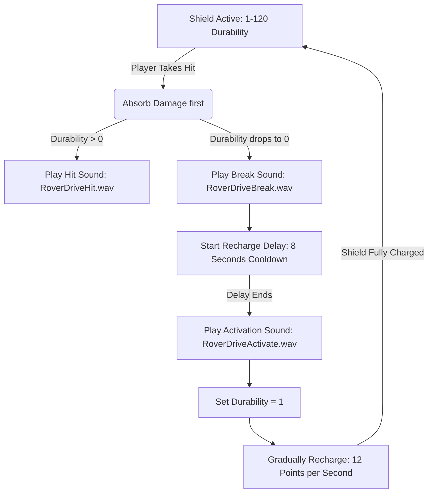

# Mechanics and UI Showcase Report: "The Sponge" in Calamity Mod

This document provides a detailed breakdown of the gameplay mechanics, user interface (UI) representation, sound assets, and visual shader rendering of **The Sponge** accessory in Calamity Mod. It is structured to serve as a comprehensive script or reference guide for video production and replication of similar shield mechanics.

---

## 1. Core Accessory Properties and Stats

The Sponge is a post-Moon Lord accessory that combines defensive utility with an energy-absorbing shield.
*   **Knockback Immunity**: Sets `player.noKnockback = true`.
*   **Static Buffs**: Grants +10% Damage Reduction (DR) (`player.endurance += 0.1f`) **only while the shield is active** (durability > 0).
*   **Shield Durability**: Maxes out at **120 points** (represented internally by `SpongeShieldDurability` and `TheSponge.ShieldDurabilityMax = 120`).

---

## 2. Shield Recharge and Damage Logic

The shield behaves like a rechargeable buffer over the player's life pool:

### Hit & Absorption Mechanics
*   When a player takes damage, the shield absorbs the hit first. 
*   **Hit Sound**: Plays `CalamityMod/Sounds/Custom/RoverDriveHit` (variable pitch, volume `0.6f`).
*   **Break Sound**: If the shield absorbs damage and its durability drops to `0`, it plays `CalamityMod/Sounds/Custom/RoverDriveBreak` (volume `0.75f`).
*   **Recharge Delay**: Upon breaking, the shield is locked out and cannot recharge for **8 seconds** (`ShieldRechargeDelay` = 480 ticks). This triggers the `SpongeRecharge` cooldown.

### Recharge Mechanics
*   Once the 8-second delay passes, the shield enters its recovery state. It plays `CalamityMod/Sounds/Custom/RoverDriveActivate` (volume `0.85f`) and sets durability to `1` so the refill can begin.
*   **Refill Rate**: The shield refills from 1 to 120 over **10 seconds** (`TotalShieldRechargeTime` = 600 ticks). 
*   **Per-Frame Accumulation**: Refills at a rate of $120 / 600 = 0.2$ shield points per frame. The decimal progress is accumulated, and when it crosses integer thresholds, it adds to the player's active shield durability.

---

## 3. Cooldown-Based UI Display (Top Left UI)

The Sponge's UI is implemented using Calamity's modular **Cooldown System**, where both active durability and recharge time inherit from [CalamityMod.Cooldowns.CooldownHandler](file:///d:/Documents/My%20Games/Terraria/tModLoader/ModSources/CalamityMod/Cooldowns/SpongeCooldowns.cs#L16). 

This is drawn as a circular radial HUD element in the top left corner of the screen:

### HUD Item 1: `SpongeDurability` (Active Shield Monitor)
*   **Condition**: Displays constantly while the accessory is worn and active durability is $> 0$.
*   **Circular Progress Bar**: 
    *   Uses a custom pixel shader (`CalamityMod:CircularBarShader`) to draw a radial fill progress ring around the item's icon.
    *   **Fill Percent**: Filled based on the ratio:
        $$\text{Fill Ratio} = \frac{\text{Current Durability}}{\text{Max Durability (120)}}$$
    *   **Ring Colors**: Lerps dynamically from a bright cyan-blue (`new Color(82, 203, 222)`) to a slightly deeper blue (`new Color(113, 178, 222)`).
*   **Central Durability Number**:
    *   Renders the current shield count as a text string (e.g., `"120"`, `"74"`) directly in the center of the circular HUD icon using `DrawBorderStringEightWay`.
    *   **Text Color Interpolation**: The number's color lerps from **cyan-blue to OrangeRed** as the shield depletes, warning the player visually that the shield is about to break:
        $$\text{Color} = \text{Lerp}(\text{Cyan-Blue}, \text{OrangeRed}, 1 - \text{Fill Ratio})$$
*   **Icon Crop Animation**: A vertical overlay sprite drains from top to bottom as the durability drops, mimicking the visual depletion of a container.

### HUD Item 2: `SpongeRecharge` (Delay Timer Monitor)
*   **Condition**: Appears when shield durability is `0` and the 8-second recharge delay is ticking down.
*   **UI Features**:
    *   Depicts a circular countdown timer sweep showing the remaining recharge delay.
    *   Renders with a grayed-out icon.
    *   Outline color: Light blue (`new Color(133, 204, 237)`).
    *   Ring colors: Lerps from `new Color(179, 212, 242)` to `new Color(113, 178, 222)` as time runs out.

---

## 4. Visual World Effects (Bubble Shield Shader)

In addition to the top-left HUD, the player's character in-game is enveloped in a glowing bubble shield:

### Shader Setup
*   **Shader Name**: `"CalamityMod:RoverDriveShield"`
*   **Base Texture**: A grayscale polygon gradient map named `Neurons` (`CalamityMod/ExtraTextures/GreyscaleGradients/Neurons`). The shader scrolls this texture over time to create a shimmering grid overlay.

### Visual Dynamics
*   **Pulsing Scale**: The bubble shield gently scales up and down over time to simulate a breathing effect:
    $$\text{Scale} = 0.155 + 0.025 \times 4^{(\sin(\text{Time} \times 0.791 + \text{PlayerID}) - 1)}$$
*   **Color Profile**: The main bubble color is a deep blue-cyan (`#189CCC`). The edges glow and highlight using a multicolor lerp shifting between that blue-cyan and a bright aqua-teal (`#22E0E3`):
    *   `EdgeColor = Lerp(Color(24, 156, 204), Color(34, 224, 227), Sin(Time * 0.2))`
*   **Opacity Damping**: The shield fades out and loses opacity as its durability decreases, scaling down to 25% opacity when the shield is at 1 point of durability:
    $$\text{Final Opacity} = (0.9 + 0.1 \times \sin(\text{Time} \times 1.95)) \times \text{Lerp}(0.25, 1.0, \text{Fill Ratio}) \times \text{UserOpacityConfig}$$
*   **Light Emission**: When the shield is up, the player emits an active ambient white light into the surrounding area:
    *   `Lighting.AddLight(Player.Center, Color.White * 0.75f)`
