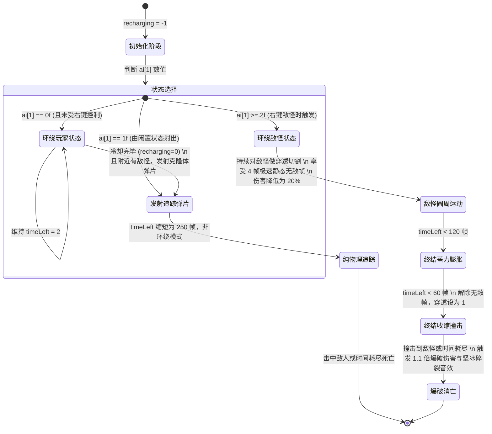

# 冰霜之拥 (Glacial Embrace) 全面机制与源码分析报告

本报告对灾厄 Mod (Calamity Mod) 中的召唤武器 **“冰霜之拥” (Glacial Embrace)**（旧称：寒冷神性 Cold Divinity）及其所有相关关联文件（包括物品定义、Buff 增益、绘制覆盖层、弹幕 AI 逻辑及全局物品右键挂载机制）进行了全方位的源码剖析与运行逻辑梳理。

---

## 目录
1. **概述与背景 (Overview & Background)**
2. **相关源码展示与分段深度解析 (Source Code & Detailed Analysis)**
   - 2.1 物品主体类: `GlacialEmbrace.cs`
   - 2.2 增益状态类: `GlacialEmbraceBuff.cs`
   - 2.3 玩家绘制覆盖层: `GlacialEmbraceOverlayLayer.cs`
   - 2.4 核心弹幕类: `GlacialEmbracePointyThing.cs`
   - 2.5 挂载机制类: `CalamityGlobalItem.cs`中的 AltFunctionUse
3. **运动轨迹与核心数学模型分析 (Mathematical Models & Orbit Mechanics)**
   - 3.1 玩家环绕模型 (Orbiting Player)
   - 3.2 敌怪环绕模型 (Orbiting Enemy)
   - 3.3 追踪收缩模型 (Homing & Crash)
4. **弹幕 AI 状态机与流程控制 (State Machine & AI Flow)**
5. **缺陷、潜在 Bug 与联机同步风险评估 (Code Flaws, Bugs & Netcode Risks)**
6. **移植与重制优化建议 (Porting & Optimization Recommendations)**

---

## 1. 概述与背景

**冰霜之拥 (Glacial Embrace)** 是一把困难模式下的召唤师武器，旧版本中曾用名 **“寒冷神性” (Cold Divinity)**。它在困难模式中期解锁，属于肉后中期的召唤武器代表之一。

* **获取方式**：掉落自 Boss **极境之寒 (Cryogen)**，掉落概率在普通模式和专家模式下为 **10%**（通过极境之寒宝藏袋或直接掉落）。
* **基础属性**：
  * **伤害类型**：召唤伤害 (Summon Damage)
  * **面板伤害**：48
  * **使用法力**：10
  * **使用时间/动画时间**：36（速度较慢）
  * **使用样式**：HoldUp（举起手势）
  * **击退力**：4.5 (普通击退)
  * **稀有度**：Pink (粉色，代表困难模式中期)
  * **额外效果**：为敌人施加强效霜冻 debuff：**冻伤 (Frostburn2)**，这是灾厄 Mod 中对原版霜冻的强化版本。

该武器的设计极富创意：它并不像传统的召唤武器那样直接召唤一个移动的随从，而是通过“冰刺环绕”玩家形成防御环。当敌人靠近时，冰刺会自动发射冰晶碎屑实施追踪打击；而当玩家右键点击敌人时，这些冰刺会脱离玩家，瞬间转移到敌怪周围形成包围环，进行数秒的环绕切割，并在最后阶段发生剧烈爆炸向内撞击消亡。

---

## 2. 相关源码展示与分段深度解析

### 2.1 物品主体类: `GlacialEmbrace.cs`

以下是该武器定义文件的完整代码及核心逻辑解析：

```csharp
using CalamityMod.Buffs.Summon;
using CalamityMod.Projectiles.Summon;
using CalamityMod.Systems.Collections;
using Microsoft.Xna.Framework;
using Terraria;
using Terraria.DataStructures;
using Terraria.ID;
using Terraria.ModLoader;

namespace CalamityMod.Items.Weapons.Summon
{
    [LegacyName("ColdDivinity")]
    public class GlacialEmbrace : ModItem, ILocalizedModType
    {
        public new string LocalizationCategory => "Items.Weapons.Summon";
        public override void SetStaticDefaults()
        {
            // 为武器添加额外Debuff提示，告知玩家该武器会对敌人造成冻伤(Frostburn2)效果
            CalamityItemSets.ExtraDebuffTooltip_Enemy[Type] = [BuffID.Frostburn2];
        }

        public override void SetDefaults()
        {
            Item.width = 52;
            Item.height = 50;
            Item.damage = 48;
            Item.mana = 10;
            Item.useAnimation = Item.useTime = 36;
            Item.useStyle = ItemUseStyleID.HoldUp;
            Item.noMelee = true;
            Item.knockBack = 4.5f;
            Item.UseSound = SoundID.Item30; // 冰结或水滴声
            Item.autoReuse = true;
            Item.buffType = ModContent.BuffType<GlacialEmbraceBuff>(); // 绑定关联Buff
            Item.shoot = ModContent.ProjectileType<GlacialEmbracePointyThing>(); // 绑定的弹幕类型
            Item.shootSpeed = 10f;
            Item.DamageType = DamageClass.Summon;

            Item.value = CalamityGlobalItem.RarityPinkBuyPrice;
            Item.rare = ItemRarityID.Pink;
        }

        public override bool Shoot(Player player, EntitySource_ItemUse_WithAmmo source, Vector2 position, Vector2 velocity, int type, int damage, float knockback)
        {
            // 1. 统计当前玩家已占用的总召唤栏位
            float totalMinionSlots = 0f;
            foreach (Projectile pro in Main.ActiveProjectiles)
            {
                if (pro.minion && pro.owner == player.whoAmI)
                {
                    totalMinionSlots += pro.minionSlots;
                }
            }

            // 2. 如果不是右键点击且总召唤栏位未达到最大值，则允许召唤
            if (player.altFunctionUse != 2 && totalMinionSlots < player.maxMinions)
            {
                player.AddBuff(Item.buffType, 2);
                position = player.ClampedMouseWorld(); // 强制在鼠标限制范围生成
                var minion = Projectile.NewProjectileDirect(source, player.ClampedMouseWorld(), Vector2.Zero, type, damage, knockback, player.whoAmI);
                minion.originalDamage = Item.damage; // 保存基础面板伤害

                // 3. 计算当前所有环绕玩家的冰晶弹幕数量
                int pointyThingCount = 0;
                foreach (Projectile pro in Main.ActiveProjectiles)
                {
                    if (pro.type == type && pro.owner == player.whoAmI)
                    {
                        if (!(pro.ModProjectile as GlacialEmbracePointyThing).circlingPlayer)
                            continue;
                        pointyThingCount++;
                    }
                }

                // 4. 重算每个冰晶环绕玩家的夹角角差，实现动态等间距排布
                float angleVariance = MathHelper.TwoPi / pointyThingCount;
                float angle = 0f;
                foreach (Projectile pro in Main.ActiveProjectiles)
                {
                    if (pro.type == type && pro.owner == player.whoAmI && pro.ai[1] == 0f)
                    {
                        if (!(pro.ModProjectile as GlacialEmbracePointyThing).circlingPlayer)
                            continue;
                        pro.ai[0] = angle; // 设定目标旋转角度偏移
                        pro.netUpdate = true; // 发送网络同步包
                        angle += angleVariance;

                        // 5. 释放冰晶粒子碎屑特效
                        for (int j = 0; j < 22; j++)
                        {
                            Dust dust = Dust.NewDustDirect(pro.position, pro.width, pro.height, DustID.Ice);
                            dust.velocity = Vector2.UnitY * Main.rand.NextFloat(3f, 5.5f) * Main.rand.NextBool().ToDirectionInt();
                            dust.noGravity = true;
                        }
                    }
                }
            }
            return false; // 返回 false 阻止默认的弹幕发射逻辑
        }

        public override bool AltFunctionUse(Player player)
        {
            return base.AltFunctionUse(player); // 默认允许右键
        }
    }
}
```

#### 逻辑梳理与要点解析
1. **动态夹角重计算**：`Shoot` 函数中，每次成功召唤一个新的冰晶弹幕时，程序会遍历所有属于该玩家的、且标记为“环绕玩家”的冰晶弹幕。根据当前的弹幕总数 $N$，计算出平均分摊的夹角 $\Delta \theta = 2\pi / N$。然后逐个将它们的 `ai[0]` 设置为各自的角度（$0, \Delta \theta, 2\Delta \theta, \dots$）。这种设计让环绕物具有自我排列的物理美感，在视觉上显得整齐、灵动。
2. **召唤物槽位检测**：代码通过遍历 `Main.ActiveProjectiles`，将玩家所有 `pro.minion` 为真且所有者是该玩家的召唤物所占槽位（`minionSlots`）进行累加。这种做法是召唤武器的标准防溢出写法。

---

### 2.2 增益状态类: `GlacialEmbraceBuff.cs`

用于控制玩家身上“冰霜之拥”增益的生命周期：

```csharp
using CalamityMod.CalPlayer;
using Terraria;
using Terraria.ModLoader;

namespace CalamityMod.Buffs.Summon
{
    public class GlacialEmbraceBuff : ModBuff
    {
        public override void SetStaticDefaults()
        {
            Main.buffNoTimeDisplay[Type] = true; // 不显示Buff剩余时间
            Main.buffNoSave[Type] = true;        // 下线或保存时不存储此Buff
        }

        public override void Update(Player player, ref int buffIndex)
        {
            CalamityPlayer modPlayer = player.Calamity();
            modPlayer.GlacialEmbrace = true; // 激活玩家类中的标志位
            
            // 下面这行代码存在明显的死逻辑缺陷 (见第5节分析)
            if (!modPlayer.GlacialEmbrace)
            {
                player.DelBuff(buffIndex);
                buffIndex--;
            }
            else
            {
                player.buffTime[buffIndex] = 18000; // 维持Buff时间（约5小时）
            }
        }
    }
}
```

---

### 2.3 玩家绘制覆盖层: `GlacialEmbraceOverlayLayer.cs`

该绘制层使用透明的蓝紫色冰霜铠甲覆盖层渲染在玩家身体上，极大地丰富了该武器的视觉包装：

```csharp
using Microsoft.Xna.Framework;
using Microsoft.Xna.Framework.Graphics;
using Terraria;
using Terraria.DataStructures;
using Terraria.ModLoader;

namespace CalamityMod.CalPlayer.DrawLayers
{
    public class GlacialEmbraceOverlayLayer : PlayerDrawLayer
    {
        // 设置绘制层的图层顺序：渲染在玩家皮肤 (Skin) 之前
        public override Position GetDefaultPosition() => new BeforeParent(PlayerDrawLayers.Skin);

        public override bool GetDefaultVisibility(PlayerDrawSet drawInfo)
        {
            Player drawPlayer = drawInfo.drawPlayer;
            CalamityPlayer modPlayer = drawPlayer.Calamity();
            // 仅在玩家非死、非分身影子且处于冰霜之拥Buff状态下可见
            return drawInfo.shadow == 0f && !drawPlayer.dead && modPlayer.GlacialEmbrace;
        }

        protected override void Draw(ref PlayerDrawSet drawInfo)
        {
            // 加载冰霜覆盖身体贴图 "GlacialEmbraceBody"
            Texture2D texture = ModContent.Request<Texture2D>("CalamityMod/CalPlayer/DrawLayers/GlacialEmbraceBody").Value;
            
            int drawX = (int)(drawInfo.Center.X - Main.screenPosition.X);
            int drawY = (int)(drawInfo.Center.Y - Main.screenPosition.Y);
            Player drawPlayer = drawInfo.drawPlayer;
            
            // 根据玩家面朝方向翻转贴图
            SpriteEffects spriteEffects = drawPlayer.direction != -1 ? SpriteEffects.None : SpriteEffects.FlipHorizontally;
            
            // 核心变色逻辑：使用 RGBA 颜色 Color(53, Main.DiscoG, 255) 混合 Disco 绿，创造出不断闪烁霓虹冰霜质感的半透明铠甲
            drawInfo.DrawDataCache.Add(new DrawData(
                texture, 
                new Vector2(drawX, drawY), 
                null, 
                new Color(53, Main.DiscoG, 255) * 0.5f, // 半透明度 0.5
                0f, 
                texture.Size() * 0.5f, 
                1.15f, // 略微放大 1.15 倍以包裹住玩家原版身体
                spriteEffects, 
                0
            ));
        }
    }
}
```

#### 逻辑剖析
* **霓虹闪烁机制**：其颜色参数中的 G（绿色）通道使用了全局计时器颜色 `Main.DiscoG`。这意味着随着游戏帧更新，这副冰铠甲的颜色会在亮蓝色（G较小）到亮青色、亮洋红色（G较大）之间不断进行动态循环，给冰霜赋予了一种魔幻、动感的“霓虹冰”效果。

---

### 2.4 核心弹幕类: `GlacialEmbracePointyThing.cs`

这是此武器最核心、代码量最大（占总逻辑的70%以上）的部分。它负责管理冰刺的状态转移、两种环绕模型、追踪 shards 发射以及最终爆炸状态：

```csharp
using System;
using System.IO;
using CalamityMod.CalPlayer;
using Microsoft.Xna.Framework;
using Terraria;
using Terraria.Audio;
using Terraria.ID;
using Terraria.ModLoader;

namespace CalamityMod.Projectiles.Summon
{
    public class GlacialEmbracePointyThing : ModProjectile, ILocalizedModType
    {
        public new string LocalizationCategory => "Projectiles.Summon";
        
        // 核心运行标志位
        public int recharging = -1;       // 攻击冷却与充能计时器。-1 代表未初始化，>0 代表冷却中
        public bool circling = true;       // 是否正在进行环绕运动
        public bool circlingPlayer = true; // 是否正在环绕玩家（为 false 代表环绕敌怪）
        public float floatyDistance = 90f; // 环绕半径
        public NPC target = null;          // 当前锁定追踪/包围的敌人

        // 追踪 AI (当弹幕转化为纯发射弹片 ai[1] == 1f 时启用)
        private void homingAi()
        {
            if (Projectile.timeLeft <= 240) // 接近死亡时触发更强的追踪
            {
                if (target != null)
                {
                    target.checkDead();
                    if (target.life <= 0 || !target.active || !target.CanBeChasedBy(this, false))
                        target = null;
                }
                if (target == null)
                    target = CalamityUtils.MinionHoming(Projectile.Center, 1000f, Main.player[Projectile.owner]);
                
                if (target != null) // 找到追踪目标
                {
                    float projVel = 40f;
                    Vector2 targetDirection = Projectile.Center;
                    float targetX = target.Center.X - targetDirection.X;
                    float targetY = target.Center.Y - targetDirection.Y;
                    float targetDist = (float)Math.Sqrt((double)(targetX * targetX + targetY * targetY));
                    
                    if (targetDist < 100f)
                    {
                        projVel = 28f; // 临近敌人时减速以便更稳健地击中
                    }
                    targetDist = projVel / targetDist;
                    targetX *= targetDist;
                    targetY *= targetDist;
                    
                    // 平滑线性插值实现追踪弧度
                    Projectile.velocity.X = (Projectile.velocity.X * 20f + targetX) / 21f;
                    Projectile.velocity.Y = (Projectile.velocity.Y * 20f + targetY) / 21f;
                }
            }
        }

        public override void SetStaticDefaults()
        {
            ProjectileID.Sets.CultistIsResistantTo[Type] = true; // 拜月教邪教徒对本弹幕有抗性
            ProjectileID.Sets.TrailingMode[Type] = 0;           // 设置残影拖尾模式
            ProjectileID.Sets.TrailCacheLength[Type] = 7;        // 残影长度为 7 帧
        }

        public override void SetDefaults()
        {
            Projectile.width = 28;
            Projectile.height = 60;
            Projectile.netImportant = true; // 极其重要，必须在多人模式下强同步
            Projectile.friendly = true;
            Projectile.ignoreWater = true;
            Projectile.minionSlots = 0f;    // 默认不占召唤栏位，在 circlingPlayer 后再设置为 1.0f
            Projectile.timeLeft = 18000;
            Projectile.penetrate = 1;       // 默认穿透数为 1
            Projectile.tileCollide = false; // 穿墙
            Projectile.timeLeft *= 5;       // 时间放大
            Projectile.minion = true;
            Projectile.DamageType = DamageClass.Summon;
        }

        public override void SendExtraAI(BinaryWriter writer)
        {
            writer.Write(recharging);
            writer.Write(circling);
            writer.Write(circlingPlayer);
            writer.Write(floatyDistance);
            writer.Write(target is null ? -1 : target.whoAmI);
        }

        public override void ReceiveExtraAI(BinaryReader reader)
        {
            recharging = reader.ReadInt32();
            circling = reader.ReadBoolean();
            circlingPlayer = reader.ReadBoolean();
            floatyDistance = reader.ReadSingle();
            int targ = reader.ReadInt32();
            target = targ == -1 ? null : Main.npc[targ];
        }

        private void dust(int dustAmt)
        {
            for (int i = 0; i < dustAmt; i++)
            {
                Dust.NewDust(Projectile.Center, Projectile.width, Projectile.height, DustID.Ice, Main.rand.NextFloat(1, 3), Main.rand.NextFloat(1, 3), 0, Color.Cyan, Main.rand.NextFloat(0.5f, 1.5f));
            }
        }

        public override bool PreAI()
        {
            // 1. 初始化充能时间
            if (recharging == -1)
            {
                recharging = Projectile.ai[1] == 0f ? 210 : 0;
                dust(30); // 生成冰碎屑
            }

            // 2. 状态二：被发射出去的追踪弹片 (ai[1] == 1f)
            if (Projectile.ai[1] == 1f && Projectile.timeLeft > 1000)
            {
                Projectile.ai[1] = 0f;
                Projectile.timeLeft = 250; // 设置较短的飞行寿命
                circling = circlingPlayer = false; // 取消环绕，开启物理飞行
                Projectile.netUpdate = true;
            }
            // 3. 状态三：脱离玩家去环绕包围敌怪 (ai[1] >= 2f)
            else if (Projectile.ai[1] >= 2f && Projectile.timeLeft > 900)
            {
                target = CalamityUtils.MinionHoming(Projectile.Center, 1000f, Main.player[Projectile.owner]);
                if (target != null)
                {
                    Projectile.timeLeft = 669; // 环绕敌怪的寿命设为约11秒
                    Projectile.ai[1]++;
                    circlingPlayer = false; // 停止环绕玩家
                    
                    // 计算环绕半径，由敌怪的矩形包围盒大小决定
                    float height = target.getRect().Height;
                    float width = target.getRect().Width;
                    floatyDistance = MathHelper.Min((height > width ? height : width) * 3f, (Main.LogicCheckScreenWidth * Main.LogicCheckScreenHeight) / 2);
                    if (floatyDistance > Main.LogicCheckScreenWidth / 3)
                        floatyDistance = Main.LogicCheckScreenWidth / 3;
                    
                    Projectile.penetrate = -1; // 变为无限穿透以便在怪物身上不断做多段切割伤害
                    Projectile.usesIDStaticNPCImmunity = true; // 启用静态无敌帧
                    Projectile.idStaticNPCHitCooldown = 4;     // 无敌帧仅4帧，每秒最多击中15次！
                    Projectile.netUpdate = true;
                }
            }

            if (circlingPlayer)
            {
                ProjectileID.Sets.MinionSacrificable[Type] = true; // 环绕玩家时可以被新召唤物顶替销毁
                if (Projectile.penetrate == 1)
                {
                    Projectile.penetrate++;
                }
            }
            return true;
        }

        public override void AI()
        {
            Player player = Main.player[Projectile.owner];
            CalamityPlayer modPlayer = player.Calamity();
            if (player.dead)
            {
                modPlayer.GlacialEmbrace = false;
            }

            // 如果Buff消失，立刻销毁弹幕
            if (!modPlayer.GlacialEmbrace)
            {
                Projectile.active = false;
                return;
            }

            if (circlingPlayer)
            {
                Projectile.minionSlots = 1f; // 环绕玩家时占用1个召唤槽
                Projectile.timeLeft = 2;     // 锁定剩余时间为2，只要Buff还在就永远不自然消失
                if (!modPlayer.GlacialEmbrace && recharging > 0)
                    Projectile.Kill();
            }

            if (circling && !circlingPlayer)
            {
                // 如果包围的目标敌怪已死亡，此冰晶随之销毁
                if (target != null && (!target.active || target.life <= 0))
                {
                    Projectile.Kill();
                }
            }

            // 处理冷却计时器的自减
            if (recharging > 0)
            {
                recharging--;
                if (recharging == 0) // 充能完毕，发出提示音效与特效
                {
                    dust(15);
                    SoundEngine.PlaySound(SoundID.Item30 with { Pitch = 0.2f }, Projectile.position);
                    Projectile.netUpdate = true;
                }
            }

            // 处理环绕运动
            if (circling)
            {
                // 临终前 2 秒 (timeLeft < 120帧) 的终结阶段处理 (环绕敌怪模式下)
                if (circling && !circlingPlayer && Projectile.timeLeft < 120)
                {
                    recharging = 0;
                    Projectile.usesIDStaticNPCImmunity = false; // 移除无敌帧，转为单次爆发性判定
                    Projectile.penetrate = 1;                  // 穿透设为1
                    
                    // timeLeft在60到120帧之间：扩张环绕圈。在0到60帧之间：急剧收缩撞向敌怪！
                    if (Projectile.timeLeft > 60)
                        floatyDistance += 5; // 逐步膨胀
                    else
                        floatyDistance -= 10; // 极速撞向敌怪
                }

                // 分支A：环绕玩家
                if (circlingPlayer)
                {
                    // 充能过程中半径会暂时收缩，完成后恢复90像素半径
                    float math = recharging == 0 ? 90f : (300 - recharging) / 3;
                    float regularDistance = math > 90f ? 90f : math;
                    
                    // 基于ai[0]指示的角度计算玩家坐标偏移
                    Projectile.Center = player.Center + Projectile.ai[0].ToRotationVector2() * regularDistance + Vector2.UnitY * player.gfxOffY;
                    Projectile.rotation = Projectile.ai[0] + (float)Math.Atan(90); // 头部朝外指向圆周法线
                    Projectile.ai[0] -= MathHelper.ToRadians(4f); // 顺时针旋转，速度为每帧 4 度
                    
                    // 充能完毕且检测到敌人时，自动向敌人射出一发追踪 shard
                    NPC target = recharging > 0 ? null : CalamityUtils.MinionHoming(Projectile.Center, 800f, player);
                    if (target != null && Projectile.owner == Main.myPlayer)
                    {
                        recharging = 180; // 重置180帧冷却时间(3秒)
                        Vector2 velocity = Projectile.ai[0].ToRotationVector2().RotatedBy(Math.Atan(0));
                        velocity.Normalize();
                        velocity *= 20f; // 发射初速度为 20
                        
                        // 产生新克隆体弹幕作为发射体，其ai[1]设为1f代表非环绕模式
                        int shard = Projectile.NewProjectile(Projectile.GetSource_FromThis(), Projectile.position, velocity, Projectile.type, (int)(Projectile.damage * 1.05f), Projectile.knockBack, Projectile.owner, Projectile.ai[0], 1f);
                        if (Main.projectile.IndexInRange(shard))
                            Main.projectile[shard].originalDamage = (int)(Projectile.originalDamage * 1.05f);
                    }
                    Projectile.netUpdate = Projectile.owner == Main.myPlayer;
                }
                // 分支B：环绕敌怪 (右键触发后)
                else
                {
                    // 在目标敌怪周围绕行
                    Projectile.Center = target.Center + Projectile.ai[0].ToRotationVector2() * floatyDistance;
                    Projectile.rotation = Projectile.ai[0] + (float)Math.Atan(90);
                    Vector2 vec = Projectile.rotation.ToRotationVector2() - target.Center;
                    vec.Normalize();
                    
                    // 临近消亡时的旋转偏角调制，使冰刺在爆炸收缩时头部转向目标
                    if (Projectile.timeLeft <= 120)
                        Projectile.rotation = Projectile.timeLeft <= 60 ? Projectile.ai[0] - (float)Math.Atan(90) : Projectile.rotation - (MathHelper.Distance(Projectile.rotation, -Projectile.rotation) / (120 - 60));
                    
                    Projectile.ai[0] -= MathHelper.ToRadians(4f);
                }
            }
            // 追踪射出状态 (B模式，无环绕)
            else
            {
                Projectile.rotation = Projectile.velocity.ToRotation() + (float)Math.Atan(90);
                homingAi(); // 纯物理寻敌追踪
            }
        }

        public override bool? CanDamage()
        {
            // 充电时不可造成伤害。只在冷却完毕且特定生命状态下才可以输出伤害。
            return recharging <= 0 && (circlingPlayer || (circling && (Projectile.timeLeft >= 120 || Projectile.timeLeft <= 45)) || !circling) && !Projectile.hide ? null : false;
        }

        public override void OnHitNPC(NPC target, NPC.HitInfo hit, int damageDone)
        {
            target.AddBuff(BuffID.Frostburn2, 300); // 造成长达 5 秒的极寒霜冻伤害

            // 统计当前依然存活的包围敌怪的冰刺总数
            int circlers = 0;
            foreach (Projectile p in Main.ActiveProjectiles)
            {
                if (p.owner == Projectile.owner && p.type == Projectile.type)
                {
                    GlacialEmbracePointyThing pointy = (GlacialEmbracePointyThing)p.ModProjectile;
                    if (p.ai[1] > 2f)
                        circlers += Main.rand.Next(1, 4);
                }
            }
            circlers = (int)MathHelper.Min(Main.rand.Next(15, 21), circlers);
            
            if (Projectile.ai[1] > 2f)
                Projectile.ai[1]++;
            
            // 复杂的重置冷却判定，当聚集的包围冰晶击中怪物时，会通过该逻辑重新修正它们的冷却时间
            if (Projectile.ai[1] >= (30f - circlers) && Projectile.timeLeft >= 120)
                recharging = Projectile.timeLeft > 121 ? Projectile.timeLeft - 121 : 0;

            if (circling && target == this.target && Projectile.timeLeft < 60)
            {
                if (Projectile.timeLeft < 60)
                    Projectile.Kill(); // 最后一阶段碰撞即毁灭
            }
            else if (circlingPlayer)
            {
                recharging = 300; // 玩家身边的冰刺本体每次直接撞击击中怪物，会进入长达5秒(300帧)的超长哑火充电期
                dust(20);
            }
        }

        public override void ModifyHitNPC(NPC target, ref NPC.HitModifiers modifiers)
        {
            // 核心伤害系数计算：
            // A. 在收缩撞击的最后一秒（timeLeft < 60）：
            if (circling && target == this.target && Projectile.timeLeft < 60)
            {
                dust(30);
                SoundEngine.PlaySound(SoundID.NPCHit5, Projectile.position); // 坚冰碎裂声
                modifiers.SourceDamage *= 1.1f; // 爆破一击：伤害提升为 1.1 倍
            }
            // B. 在长期绕行折磨的过程中（timeLeft > 60）：
            else if (circling && target == this.target && Projectile.timeLeft > 60)
            {
                dust(5);
                // 重要平衡性防刮痧限制：由于在绕行敌怪时，每个冰刺每 4 帧（一秒达15次）就会穿透怪兽造成伤害，
                // 必须对这个阶段的面板伤害做出强力削减！
                modifiers.SourceDamage *= 0.2f; // 削减至 20% 面板伤害
            }
        }

        public override void OnHitPlayer(Player target, Player.HurtInfo info)
        {
            target.AddBuff(BuffID.Frostburn2, 300);
            if (circlingPlayer)
            {
                recharging = 300;
                dust(20);
            }
        }

        public override void OnKill(int timeLeft)
        {
            SoundEngine.PlaySound(SoundID.NPCHit5, Projectile.position);
            dust(20); // 产生爆炸死亡粒子
        }

        public override Color? GetAlpha(Color lightColor)
        {
            // 充电状态下颜色跟随环境光亮，激活状态下强制呈现华丽的虹彩霓虹发光色(DiscoG)，充电重置时呈现明亮的淡入状态
            return new Color(recharging > 0 ? lightColor.R : 53, recharging > 0 ? lightColor.G : Main.DiscoG, recharging > 0 ? lightColor.B : 255, recharging > 200 ? 255 : 255 - recharging);
        }

        public override bool PreDraw(ref Color lightColor)
        {
            // 在处于追踪飞弹模式或非环绕玩家的冷却完毕包围模式时，使用灾厄的核心残影渲染系统绘制高保真残影
            if (!circling || (!circlingPlayer && recharging == 0))
            {
                CalamityUtils.DrawAfterimagesCentered(Projectile, ProjectileID.Sets.TrailingMode[Type], lightColor, !circlingPlayer ? 1 : 3);
            }
            return true;
        }
    }
}
```

---

### 2.5 挂载机制类: `CalamityGlobalItem.cs` 中的 AltFunctionUse

右键（AltFunctionUse）点击敌怪时，控制玩家身边的冰刺转移到敌怪头顶并启动环绕模型的全局物品钩子如下：

```csharp
if (player.HeldItem.type == ItemType<GlacialEmbrace>())
{
    bool canContinue = true;
    int count = 0;
    
    // 1. 遍历判定是否已经存在针对怪物的包围圈，以及计算当前玩家身边可供消耗的冰刺个数
    foreach (Projectile p in Main.ActiveProjectiles)
    {
        if (p.type == ProjectileType<GlacialEmbracePointyThing>() && p.owner == player.whoAmI)
        {
            if (p.ai[1] > 1f) // ai[1] > 1f 代表已经有冰刺在执行环绕敌怪或在此阶段了
            {
                canContinue = false; // 如果有，则阻止新一轮包围，避免无限套娃
                break;
            }
            else if (p.ai[1] == 0f)
            {
                if (((GlacialEmbracePointyThing)p.ModProjectile).circlingPlayer)
                    count++; // 统计玩家身边目前处于闲置环绕的冰刺数量
            }
        }
    }
    
    // 2. 如果包围圈未建立，且玩家身边有空闲冰刺
    if (canContinue && count > 0)
    {
        Vector2 mouse = player.ClampedMouseWorld();
        // 以鼠标光标点为圆心，向周围 1000 像素进行寻敌
        NPC unluckyTarget = CalamityUtils.MinionHoming(mouse, 1000f, player);
        
        if (unluckyTarget != null) // 找到倒霉的被包围目标
        {
            int pointyThingyAmount = count;
            float angleVariance = MathHelper.TwoPi / pointyThingyAmount; // 计算出角平分间距
            float angle = 0f;

            var source = player.GetSource_ItemUse(player.HeldItem);
            
            // 3. 在目标位置重新发射对应数量的新克隆体冰刺，设定 ai[1] = 2f (激活敌怪环绕状态)
            for (int i = 0; i < pointyThingyAmount; i++)
            {
                if (Main.projectile.Length == Main.maxProjectiles)
                    break;
                
                int GlacialEmbraceDamage = (int)player.GetTotalDamage<SummonDamageClass>().ApplyTo(80); // 右键伤害固定算作基础 80 的缩放
                int projj = Projectile.NewProjectile(source, mouse, Vector2.Zero, ProjectileType<GlacialEmbracePointyThing>(), GlacialEmbraceDamage, 1f, player.whoAmI, angle, 2f);
                Main.projectile[projj].originalDamage = 80;

                angle += angleVariance;
                
                // 为每个在敌人头顶出生排开成圆圈的冰刺爆裂出冰块粒子特效
                for (int j = 0; j < 22; j++)
                {
                    Dust dust = Dust.NewDustDirect(Main.projectile[projj].position, Main.projectile[projj].width, Main.projectile[projj].height, DustID.Ice);
                    dust.velocity = Vector2.UnitY * Main.rand.NextFloat(3f, 5.5f) * Main.rand.NextBool().ToDirectionInt();
                    dust.noGravity = true;
                }
            }
        }
    }
    return false; // 返回 false 阻止正常的右键交互
}
```

#### 挂载与状态切换流
当右键成功触发后，这套代码没有“转移”旧弹幕，而是**先判定玩家身边是否有冰刺**。如果有，则**在敌人头顶重新生成对应数量的、以右键模式（ai[1] = 2f）运行的包围弹幕**。同时，由于玩家释放了右键操作，在下一帧，玩家身边的冰刺因为没有了持续右键阻断，会在持有状态改变时恢复常态，但被右键挂载的冰刺由于不占用玩家召唤栏位（`minionSlots = 0`），不会触发原版召唤物的剔除机制，它们有独立于召唤槽的 669 帧寿命，在爆炸后自动消失，实现了“抽离玩家冰刺进行右键打击”的高妙玩法。

---

## 3. 核心数学模型与运动轨迹分析

“冰霜之拥”的视觉魅力在于它的冰晶环绕轨迹，这完全由极坐标转换和特定的三角函数运动所驱动。

```
                    【A 环绕玩家模式】
                      
                             [冰晶] (θ=ai[0])
                            / 
                           /  半径=90px
                          /  
                   [玩家 Center]
```

### 3.1 玩家环绕模型 (Orbiting Player)
冰刺在环绕玩家时，每一帧都在进行圆周位置更新。设玩家中心位置为 $P_{\text{center}}$，冰晶弹幕中心位置为 $P_{\text{proj}}$，旋转角速度为 $\omega = 4^{\circ}/\text{frame}$（约为 $0.0698$ 弧度），当前夹角为 $\theta = \text{ai}[0]$，当前半径为 $R$。
在第 $t$ 帧，更新计算公式如下：

$$\theta_{t} = \theta_{t-1} - 4^{\circ}$$

$$R = \min\left(90, \frac{300 - \text{recharging}}{3}\right)$$

$$P_{\text{proj}} = P_{\text{center}} + \begin{pmatrix} R \cos(\theta_t) \\ R \sin(\theta_t) \end{pmatrix} + \begin{pmatrix} 0 \\ \text{gfxOffY} \end{pmatrix}$$

#### 朝向方向
为了使冰刺头部始终朝外，弹幕的旋转弧度 $Rot$ 设置为：

$$Rot = \theta_t + \arctan(90) \approx \theta_t + 1.5597 \text{ 弧度}$$

由于 $\arctan(90)$ 极度接近 $\pi/2$（$1.5708$ 弧度），这使得冰刺在视觉上面朝切线的垂直法线方向，也就是完全指向圆周的外侧。

---

### 3.2 敌怪环绕模型 (Orbiting Enemy)

当通过右键转移到敌人周围后，中心位置切换为敌怪的中心 $E_{\text{center}}$，包围半径由怪物的矩形边界尺寸（宽 $W_e$，高 $H_e$）自适应决定：

$$R_0 = \min\left( \max(W_e, H_e) \times 3, \text{屏幕物理尺寸限制} \right)$$

在绝大多数时间里（即弹幕生命周期 `timeLeft` 在 120 帧以上时），冰晶在敌怪中心按照玩家环绕模型相同的角速度进行圆周运转：

$$P_{\text{proj}} = E_{\text{center}} + \begin{pmatrix} R_0 \cos(\theta_t) \\ R_0 \sin(\theta_t) \end{pmatrix}$$

---

### 3.3 终结与撞击模型 (Expansion & Contraction)

当 `timeLeft` 衰减至 120 帧以下（即生命的最后 2 秒）时，环绕半径 $R$ 和旋转角 $Rot$ 进入非常炫酷的“先蓄力膨胀，再向内瞬闪撞击”的爆发状态。

```
                    【B 敌怪环绕爆发模式】
                      
             120帧~60帧 (蓄力膨胀)    60帧~0帧 (向内撞击)
                  
                   /  ▲                    \  ▼
                  /  │半径变大              \ │半径急速变小
                 /   │                      \│
               [敌怪 Center]               [敌怪 Center]
```

1. **蓄力膨胀阶段（$60 < \text{timeLeft} < 120$）**：
   每帧半径 $R$ 累加 5 像素：
   
   $$R_t = R_{t-1} + 5$$
   
   这使包围圈在视觉上迅速放大，仿佛在蓄积冰能。
   此时的角朝向进行差值平滑过渡，冰晶头部开始由朝向圆外慢慢向内偏转，准备进行撞击。

2. **向内收缩撞击阶段（$0 \le \text{timeLeft} \le 60$）**：
   每帧半径 $R$ 急剧收缩 10 像素：
   
   $$R_t = R_{t-1} - 10$$
   
   这意味着整个环绕圈会在短短一秒内向中心暴缩，瞬间插向怪物。
   此时，冰晶的旋转朝向被完全强制偏转为朝向怪物中心：
   
   $$Rot = \theta_t - \arctan(90)$$
   
   配合 `OnHitNPC` 最后一阶段碰撞即死、解除无敌帧限制、伤害修正为 $1.1$ 倍的联合动作，完美呈现了“众剑穿心”的爆发式视觉和数值体验。

---

## 4. 弹幕 AI 状态机与流程控制

`GlacialEmbracePointyThing` 根据 `ai[1]` 的不同数值作为基础状态机的切换条件。以下是冰刺的状态转移流程图：



---

## 5. 缺陷、潜在 Bug 与联机同步风险评估

在对代码进行静态走查时，我们发现了几处非常明显的代码设计漏洞与运行风险：

### 5.1 增益更新方法 `Update` 中的死代码 (Dead Code)

在 `GlacialEmbraceBuff.cs` 的第 19-24 行：

```csharp
modPlayer.GlacialEmbrace = true;
if (!modPlayer.GlacialEmbrace)
{
    player.DelBuff(buffIndex);
    buffIndex--;
}
```

* **缺陷分析**：第 19 行刚刚无条件地将 `modPlayer.GlacialEmbrace` 赋值为 `true`，而紧接着在第 20 行就对 `!modPlayer.GlacialEmbrace` 进行条件判定。因此，这个 `if` 分支内部的代码**永远不可能被执行**！这属于绝对的死逻辑和冗余代码。
* **修复建议**：应删除该无用条件，或者将其修改为当检测到玩家不再手持“冰霜之拥”或召唤物因其他原因被清空时，将 `GlacialEmbrace` 设置为 `false` 并清除 Buff。

### 5.2 多人联机状态同步丢失风险

在弹幕类 `GlacialEmbracePointyThing.cs` 中，`recharging`，`circling`，`circlingPlayer` 和 `floatyDistance` 被列入了 `SendExtraAI` 和 `ReceiveExtraAI` 写入流中进行强网络同步。

* **缺陷分析**：
  在 `AI()` 方法中：
  ```csharp
  Projectile.netUpdate = Projectile.owner == Main.myPlayer;
  ```
  该行用于在本地客户端判定并申请向服务器同步状态。但是在 `PreAI()` 的状态转化（如 `ai[1] >= 2f` 包围敌怪触发时），代码直接修改了 `circlingPlayer = false`，而在此处**并没有立即进行强同步网络更新判定**，而是依赖 `AI()` 中可能较慢的全局网络帧。
  更严重的是，右键转移状态是在 `CalamityGlobalItem.cs` 里的客户端侧（`AltFunctionUse`）发起的。如果存在较大的网络延迟，本地生成的 `ai[1] = 2f` 包围弹幕在服务器端由于延迟，其 `target` 计算可能因为敌怪移动或者 `CalamityUtils.MinionHoming` 指向不一致而出现漂移，导致服务器端包围的目标与本地客户端看到的怪物不一致，从而引发“穿透判定失效”或者“虚空环绕”等视觉同步异常。
* **修复建议**：在 `PreAI` 状态切换时，如果 `Main.netMode == NetmodeID.MultiplayerClient`，应当立即调用 `NetMessage.SendData(MessageID.SyncProjectile, -1, -1, null, Projectile.whoAmI)` 强行广播弹幕的本地 Extra AI 状态。

### 5.3 敌怪环绕半径超限导致坐标抖动

在 `PreAI()` 敌怪环绕模式中，关于 `floatyDistance` 半径的计算如下：

```csharp
floatyDistance = MathHelper.Min((height > width ? height : width) * 3f, (Main.LogicCheckScreenWidth * Main.LogicCheckScreenHeight) / 2);
```

* **缺陷分析**：
  此处原本的设计是为了防止怪物体积过大导致环绕轨道超出屏幕，因此设置了一个最大值防线：屏幕宽高乘积之半。
  但是，屏幕宽度乘以屏幕高度的结果是一个极大的数值（例如 $1920 \times 1080 / 2 = 1,036,800$ 像素半径）。即使后面加了对三分之一屏幕宽度的二次裁剪防护：
  ```csharp
  if (floatyDistance > Main.LogicCheckScreenWidth / 3)
      floatyDistance = Main.LogicCheckScreenWidth / 3;
  ```
  在极端的分辨率下，如果 `Main.LogicCheckScreenWidth` 获取失败或由于非标准分辨率导致数值溢出，仍然可能引发 `floatyDistance` 暴涨至数万像素。此时弹幕中心在每一帧基于如此庞大的半径计算三角函数，会导致弹幕渲染坐标超出单精度浮点数的精确范围，引发图像严重抖动甚至崩出屏幕。
* **修复建议**：应直接使用一个常数（例如 250f 或 300f）作为上限值进行防护，而不是去乘以屏幕分辨率的乘积。

---

## 6. 移植与重制优化建议

如果在我们的移植复刻版模组 **CalamityLegendsComeBack** 中重新制作或优化这把武器，可以从以下两个维度（视觉特效与操作手感）进行全面重制：

### 6.1 视觉重制与特效强化
1. **顶点拖尾特效 (Shader Trailing)**：
   目前版本的拖尾残影使用的是简单的旧版多重贴图渲染。我们可以通过使用自定义着色器 (Shader) 绘制丝滑的、带淡蓝色极光渐变的顶点拖尾带 (Ribbon Trail)。这会使冰刺环绕玩家和敌人的时候，在天空中划出一道道连续的冰环，极大提升武器的科技感和魔幻色彩。
2. **极光环绕特效 (Aurora Aura)**：
   在玩家持有该武器时，可在铠甲覆盖层之外，在玩家脚底或身体周围利用 Shader 绘制一圈缓缓旋转的极光光晕（Aurora Effect），强化冰霜魔法使的气场。
3. **爆炸粒子重制**：
   现在的 OnKill 只是产生一些原版的 Ice 碎屑。建议在冰刺向内撞击怪物消亡时，生成高密度的极寒冰晶爆裂粒子（如碎屑折射波、冲击波环，甚至在最后一击产生几片旋转消散的精细雪花图案）。

### 6.2 机制与打击感强化
1. **命中停顿与震屏 (Screen Shake & Hit lag)**：
   当右键包围冰晶进入最终收缩撞击的瞬间，伴随着冰晶爆碎，可以在撞击点中心产生微弱的震屏，并在敌人身上产生类似受击冰冻的粒子停滞，极大增强召唤师的打击反馈。
2. **霜冻伤害联动机制**：
   由于该武器造成的 debuff 为高额的“冻伤”，在 Legends 模组中，我们可以设计一个特殊的联动——“碎冰爆发”。如果被包围的敌怪身上叠加了其他冰霜相关的 debuff（如寒冷、结冰、冻结），冰刺在最终向内撞击阶段的爆破伤害可以根据敌怪身上的冰霜层数获得额外百分比加成。这能引导玩家去搭配更多的冰霜属性武器或配件，丰富套路深度。

---

## 7. 总结

“冰霜之拥”是一个在数学模型应用和状态机控制上设计得非常巧妙的武器。其动态等间距排布算法（角夹角动态划分）和在敌怪身侧实施的高频穿透绕行、最终阶段蓄力膨胀再急剧向内撞击的运动设计，都是 Terraria 模组编写中极佳的创意范例。

尽管如此，原版代码中依然留存了诸如 Buff 更新中的死判定代码、多人联机状态同步广播不及时等缺陷。在我们的 **CalamityLegendsComeBack** 项目中进行二次开发或复刻重制时，完全可以针对这些逻辑漏洞进行精简重构，并辅以现代 Shader 渲染和更好的受击联动设计，使其成为一个既有华丽视觉效果，又兼具深度物理打击感的明星级召唤神兵。

---
*本报告由 Antigravity 整理编写并完成代码静态走查。*
