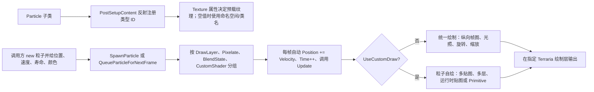

# 灾厄 Particles 全库源码审计与原创特效迁移方案

> 审计对象：`ModSources\CalamityMod` 当前本地 `1.4.4` 分支  
> 审计日期：2026-07-29  
> 输出用途：为另一个原创模组建立自有粒子库、复合特效语言与迁移边界  
> 结论性质：源码与视觉设计分析，不构成法律意见

## 0. 先给最终结论

可以借鉴灾厄，但不应该以“改到看不出来”为目标。正确目标是：**从灾厄中抽象出通用的特效问题和技术范式，然后使用自己的贴图轮廓、时序曲线、空间拓扑、颜色规则和玩法绑定重新求解。**

当前仓库的许可证把源代码、视觉资产、音频资产等明确列为 Azafure, LLC 的专有内容；许可证允许把源码作为开发参考，但如果直接提取代码，必须署名 Azafure, LLC 并链接项目或许可证。许可证并没有把灾厄贴图开放为可自由复制的素材包。公开仓库当前也显示同样条款：

- [CalamityModPublic 1.4.4 LICENSE](https://github.com/CalamityTeam/CalamityModPublic/blob/1.4.4/LICENSE.md)
- 本地依据：`ModSources\CalamityMod\LICENSE.md:1,15-16`

因此，本报告采用以下四档判断：

| 档位 | 含义 | 实际行动 |
|---|---|---|
| P1·从零重写 | 是通用而高价值的能力 | 保留“要解决的问题”，重新设计类、参数、数学、贴图与时序 |
| P2·按内容重写 | 有价值，但不是基础设施 | 只有具体武器或 Boss 需要时再做原创版本 |
| R·仅作参考 | 灾厄辨识度、角色绑定或组合语法过强 | 不搬贴图、不照着数值复刻；只记录它解决了什么反馈问题 |
| X·不建议建设 | 重复、失去调用、维护问题明显或性价比低 | 不迁移；让新的通用类覆盖该需求 |

最值得带走的不是 `GlowSpark.png`、`BloomCircle.png` 或某个构造函数，而是六项抽象能力：

1. 粒子生命周期、图层、混合状态和重要性预算的统一管理。
2. “运动粒子”与“相对坐标粒子集合”的分离。
3. 贴图层、运动层、时序层和玩法状态层的解耦。
4. 预警粒子在粒子上限下仍然保留的可靠性规则。
5. 从单粒子积木组合出蓄力、命中、挥砍、环境场和状态反馈。
6. 对像素化、Primitive、Metaball、RenderTarget 等高阶系统明确分层，而不是把一切都叫粒子。

最不应该带走的是：灾厄现成 PNG、灾厄角色或武器符号、完全一致的叠层顺序、完全一致的出生数量/速度/寿命，以及 `Ares`、`Wulfrum`、`Providence`、`Lilies of Finality` 等内容身份资产。

## 1. 审计范围与真实规模

本次不是只看文件名，而是读取了 `Particle` 基类、注册与绘制管理器、所有 `Particles\*.cs`、对应 PNG、外部引用文件、粒子集合、像素化系统、Primitive 与 Metaball 邻接系统。

| 项目 | 当前实测 |
|---|---:|
| `Particles\*.cs` | 117 个文件 |
| `Particle` 直接子类 | 109 个 |
| `BaseParticleSet` 具体集合 | 4 个 |
| 粒子支持文件 | 4 个：`Particle`、`GeneralParticleHandler`、`BaseParticleSet`、`DeathAshParticle` |
| `Particles\*.png` | 169 张 |
| `Particles` C# 总行数 | 8,302 行 |
| 覆写 `UseCustomDraw = true` | 86 个粒子类 |
| 固定声明 Additive | 56 个；另有 15 个由构造参数动态决定 |
| 使用 NonPremultiplied/半透明通道 | `DesertProwlerSkullParticle`、`GenericBubbleParticle`；`HeavySmokeParticle` 动态选择 |
| 使用 `InvisibleProj` 作为注册占位纹理 | 9 个；真正图像在自绘或外部手动绘制阶段决定 |
| 当前没有外部引用的粒子子类 | 8 个 |

旧报告 `特效\Particles文件总结与贴图评价.md` 覆盖的是 159 张 PNG 和 109 个 C# 文件。当前源码比旧报告新增了 10 张 PNG 与 8 个 C# 文件，因此本报告以当前源码为准，并把旧报告当作贴图外观词典，而不是当作当前调用事实。

## 2. 灾厄粒子从类到屏幕的完整链路

关键源码点：

- `Particles\Particle.cs:8-148`：统一保存位置、速度、颜色、旋转、缩放、寿命、帧、像素化和绘制层。
- `Particles\GeneralParticleHandler.cs:68-86`：反射枚举所有 Mod 的 `Particle` 子类，分配类型 ID，并读取 `Texture`。
- `GeneralParticleHandler.cs:141-190`：直接生成与“下一帧生成”两条入口；后一条用于粒子在自己的 `Update` 内继续生成粒子，避免迭代集合时修改集合。
- `GeneralParticleHandler.cs:252-289`：统一推进位置与时间、执行子类更新、回收寿命结束的粒子。
- `GeneralParticleHandler.cs:305-349`：默认绘制或 `CustomDraw` 二选一；默认绘制只支持一列纵向帧图。
- `GeneralParticleHandler.cs:351-483`：按图层、像素化、Alpha/Additive/NonPremultiplied、自定义 Shader 分桶绘制。

### 2.1 纹理不是总能从 `Texture` 一眼看出

有四种绑定形态：

1. **固定单贴图**：如 `BloomParticle -> Particles/BloomCircle`。
2. **固定多层贴图**：如 `CritSpark -> ThinSparkle + BloomCircle`，`PearlParticle -> PearlParticle + PearlParticleGlow`。
3. **占位纹理 + 运行时纹理**：`CustomSpark`、`CustomPulse`、`VelChangingSpark` 等把 `Texture` 写成 `InvisibleProj`，实际由构造参数传入。
4. **完全外部绘制**：`BrainOfCthulhuAfterImage` 在粒子管理器里只更新，真正绘制由 Boss AI 保存的列表手动调用；`ThrusterParticle` 直接构造三角带；`DeathAshParticle` 自成 RenderTarget + 顶点批次系统。

所以“把 CS 与同名 PNG 一一复制”并不能得到完整效果，很多效果的身份来自第二层贴图、调用方传入纹理、生成阵型和玩法时序。

### 2.2 混合方式的真实含义

- `AlphaBlend`：实体碎屑、烟、图标、表情、物件最稳妥；保留暗部和颜色体积。
- `Additive`：光、火花、光环、能量爆点；黑色或透明区域基本不贡献亮度，叠太多会过曝。
- `NonPremultiplied`：适合带半透明颜色边缘的气泡或薄雾；贴图处理错误时容易出现黑边/暗边。
- `Pixelate`：不是换一张像素贴图，而是把绘制排入半分辨率 RenderTarget，再用 PointClamp 放大。

原创模组不应让每个粒子自己随意 `spriteBatch.End/Begin`。正确做法是由管理器按状态批处理，只有 Primitive 或特殊后处理才在明确边界切换。

## 3. 支持系统逐项审计

| 文件/系统 | 做了什么 | 可用在哪里 | 原创模组建议 |
|---|---|---|---|
| `Particle.cs` | 粒子数据协议与虚方法 | 所有短命视觉对象 | P1：重新定义自己的最小接口；不要照抄字段排列和注释 |
| `GeneralParticleHandler.cs` | 注册、预载、上限、更新、分层和按混合状态批处理 | 全局粒子基础设施 | P1：必须有，但应自行实现；它还注明受 Spirit 与 Luminance 启发 |
| `BaseParticleSet.cs` | 相对中心的手动粒子组，不占全局粒子上限 | 武器蓄力、附魔场、跟随实体的烟/火 | P1：概念很有价值；重写时修正排序与混合职责 |
| `AresCannonChargeParticleSet` | 收束线 + 呼吸 Bloom + 分段 Pulse | 炮口蓄力、Boss 武器前摇 | R：组合节奏和 Ares 身份很强；只能重新设计节拍与图形语法 |
| `ChargingEnergyParticleSet` | 圆周边缘粒子向中心插值 | 附魔、锻造、吸能 | P1：通用问题，可用不同轨道与非圆形边界重写 |
| `FireParticleSet` | 相对中心持续生成火苗 | 持续燃烧状态、实体附着火焰 | P1：通用；建议加密度预算、碰撞和材质配置 |
| `ThanatosSmokeParticleSet` | 沿基础旋转方向喷出烟帧 | 机械过热、喷口、受损部件 | R/P2：功能可重做，但不要保留 Thanatos 的运动和配色组合 |
| `DeathAshParticle` | 把 NPC 绘到临时 RenderTarget，读取非空像素，再生成最多 45,000 个方片并用 Primitive 批次绘制 | 大型处决、消散、石化解体 | P2 高价值高风险：保留“从轮廓生成解体”的问题，不要复制逐像素灰烬方案；改成块聚类、轮廓采样或自制溶解遮罩 |
| `TempParticleManager` | 对固定容量通用粒子做对象池、并行更新和自定义绘制 | 局部短期系统、背景粒子 | X/P1：当前仓库无实际消费者；`particleUpdateFunction` 声明可选却直接 `Invoke`，应自行重写而不是搬 |
| `PixelationManager` | 半分辨率 RenderTarget + PointClamp 放大，并按层/混合状态缓存 | 像素化雾、能量块、低分辨率爆炸 | P1：能力值得建，但接口应避免粒子内部二次排队 |
| `PrimitiveRenderer` | 轨迹采样、切线/法线、宽度函数、颜色函数、索引缓冲与 Shader | 弹幕拖尾、刀光、光束、丝带 | P1：这是独立于 Sprite 粒子的核心系统；优先自行实现或选择许可明确的上游库 |
| `Metaball`/`MetaballManager` | RenderTarget 中绘制灰度实例，再以边缘 Shader 与滚动层纹理合成流体 | 血、熔岩、星烟、虚空、扭曲场 | P2：只在确有融合流体需求时建；必须使用原创层纹理、边缘语言和状态绑定 |

### 3.1 不应继承的实现问题

1. `BaseParticleSet.DrawSet` 计算了 `orderedParticles`，但实际循环仍然使用 `Particles.OrderBy(p => p.Time)`，自定义 `OrderFunction` 没有生效。
2. `BaseParticleSet` 的默认绘制把旋转写死为 `0f`，也不处理粒子自己的光照和混合状态，调用方必须隐式保证 SpriteBatch 状态。
3. `TempParticleManager` 的更新委托参数文档写成可选，`Update` 却无判空直接调用。
4. `GeneralParticleHandler` 支持 `CustomShader`，当前 109 个粒子子类没有一个真正覆写它；这是预留接口，不是成熟粒子 Shader 样例库。
5. `CustomSpark`、`CustomColorChangeSpark`、`CustomPulsingSpark` 在 `Pixelate=true` 时，管理器已经把粒子排入像素化目标，类内又调用一次 `AddPixelatedDrawer`。按当前事件顺序存在二次排队被清空、粒子不出图的明显风险，应测试后重构。
6. 动态 `UseAdditiveBlend` 只在生成时决定所属绘制集合；粒子出生后再改 `AltVisual` 或 `Glowing` 不会自动迁移集合。
7. `ThrusterParticle` 每次自绘都会切 SpriteBatch、建立 `RasterizerState` 并直接绘制三角带，适合专用效果，不适合作为高频通用粒子模板。

## 4. 109 个 `Particle` 子类逐项矩阵

说明：表中的“现用”是代表性调用，不等于穷举；“适合”是功能场景，不代表允许复制贴图或代码。所有 P1/P2 都要求原创贴图和独立实现。

### 4.1 A—C

| 类 | 实际贴图链与绘制 | 现用与适合场景 | 建议 |
|---|---|---|---|
| `AltLineParticle` | `DrainLine`；Alpha 双层细线，速度朝向，阻尼、三次方淡出、可重力 | 现用于玩家绘制、火球与旋风；适合暗色吸能、物理感划线 | P1：用原创非对称细线重写 |
| `AltSparkParticle` | 外部 `Projectiles/StarProj`；与上者同运动但星形 | 20 个文件引用；适合不过曝命中碎光 | P1：不要沿用 StarProj 轮廓，合并到自有 Streak/Mote |
| `AresSummonCrateParticle` | `AresSummonCrate`；跟随玩家/重力的主题物件自绘 | 仅 `AresExoskeleton`；机械召唤箱抛出 | R：Ares 身份资产，不迁移 |
| `ArianeFakeDust` | `FakeDust/FakeDustBig`；绑定弹幕相对坐标的加法尘点 | 仅 `LiliesOfFinalityAoE`；适合附着弹幕的轻光尘 | R/P2：功能可重做，角色贴图和节奏不可搬 |
| `AuraPulseRing` | `HollowCircleHardEdge`；附着 NPC，原始/最终二维缩放插值 | `CalamityPolarityNPC`；适合范围、极性、护盾边界 | P1：用断环/多瓣轮廓替代标准硬圆 |
| `BaneParticle` | `BaneParticleGlow + BaneParticle` 五帧双层符号；颜色插值、正弦横摆、旋转/拉伸/重力可配 | `Bane` Debuff；适合诅咒符文飞散 | R：符号序列辨识度高；只保留“双层符号粒子”这个问题 |
| `BloodParticle` | `Blood`；加法双绘，阻尼、重力、缩小 | 33 个文件，伤害 Debuff、血系武器、NPC 命中 | P2：血雾是通用类别，但应自画飞溅形与改用 Alpha 主体 + 少量亮边 |
| `BloodParticle2` | `Blood2`；较大多段血液纹理自绘 | 当前源码无外部引用 | X：不迁移；由新血滴/血雾系统替代 |
| `BloomLineVFX` | `BloomLine`，可加 `BloomLineCap`；按向量拉伸，Telegraph 可标 Important | SHPV、方舟/银河武器；适合直线闪、激光段、瞄准线 | P1：通用能力；重画端帽和亮度剖面 |
| `BloomParticle` | `BloomCircle`；单圆光从原始缩放到最终缩放，可选淡出 | 23 个文件，Boss、武器、命中核心 | P1：建立自有光核，但不要复制灾厄圆光纹理与固定包络 |
| `BloomRing` | `BloomRing`；加法圆环，速度移动、随寿命缩小/淡出 | 66 个文件，范围反馈、传送、命中 | P1：基础能力；建议用非均匀环宽或分段环形成原创语言 |
| `BoltParticle` | `Bolt2` 三帧；拉伸、亮芯、淡入、横向收缩/纵向增长 | Draedon 弹药、Volterion、Dragoon；适合短电弧碎片 | P2：新画电弧帧并改变折点统计，不能复用 Bolt2 |
| `BossRoar` | `RoarPulse`；Alpha 咆哮波，旋转、二维尺度与透明度包络 | 克脑 AI；适合咆哮、声压、精神波 | P2：用偏心声波或破碎波重做，避免同心淡圆 |
| `BrainOfCthulhuAfterImage` | 注册纹理是 `InvisibleProj`；沿 Bezier 点移动，真正用原版克脑纹理由 Boss PreDraw 手动绘制 | 仅克脑 AI；适合沿路径移动的实体残像 | P1 技术问题、R 现成实现：建立通用 SpriteSnapshot，不复制 Boss 特例 |
| `BrokenTendril` | `InvisibleProj`；运行时读取 NPC 触须素材，重力、碰撞、淡出 | 当前源码无外部引用 | X：孤立特例，不迁移 |
| `ChargeUpLineVFX` | `Light` 被拉成收束线；相对坐标、分段 easing、亮色双绘 | 仅 Ares 蓄力集合；适合能量向核心吸入 | R/P1：收束概念通用，但 Ares 的五段脉冲节拍不应复刻 |
| `ChumBone` | `ChumBone1/2`；物理骨片与变体 | 当前源码无外部引用 | X：内容物件，不建设通用库 |
| `CircularSmearSmokeyVFX` | `CircularSmearSmokey`；固定 20 帧加法圆弧 | 方舟与银河挥砍；适合烟雾旋斩 | R：灾厄挥砍笔触辨识度较高；自画分段/颗粒弧 |
| `CircularSmearVFX` | 默认 `CircularSmear`，也可传入任意 `Asset<Texture2D>`；加法自绘 | Lightspeed、Lucrecia、Biome Blade；适合环斩、旋转武器 | P2：保留“可注入弧纹理”的接口思想，重做全部弧形素材 |
| `ConstellationRingVFX` | `HollowCircleSoftEdge + Sparkle + BloomCircle`；软环上布置星点并旋转 | `Galaxia_PolarisGaze`；适合星座、召唤法阵、锁定环 | R：三层构图很像银河系武器；原创版本必须改变拓扑而非只换色 |
| `CrackParticle` | `Crack`；加法裂纹，二维压缩、旋转和尺度插值 | Void Vortex、Volterion、Reality Rupture；适合空间/地面裂隙 | P2：重新程序化折线或自画裂纹，避免复用 333×768 轮廓 |
| `CritSpark` | `ThinSparkle + BloomCircle`；星芯旋转、Bloom、减速、可 Hue Shift | 62 个文件，暴击/神圣/冰暗命中 | P1：通用命中语法；使用原创星芯形和不同亮度时序 |
| `CustomColorChangeSpark` | 注册 `InvisibleProj`，实际纹理由调用方传入；颜色起终点、拉伸、重力、旋转、亮芯、像素化可配 | Dryad's Tear、Elumphant；适合通用可换色条形粒子 | P1：应拆成干净配置对象；修正像素化双排队风险 |
| `CustomPulse` | 注册 `InvisibleProj`，运行时任意纹理；二维压缩、旋转、尺度插值、Additive/Alpha、光照可配 | 170 个文件，当前最广泛复合爆点适配器 | P1：能力必须有，但不要复制“大参数构造器”；改为命名配置/Recipe |
| `CustomPulsingSpark` | 前景纹理 + 背景纹理；周期膨胀、正弦位移、转向、亮芯与像素化 | WindChilled、Elumphant；适合呼吸状双层尾粒 | P2：运动组合有价值；重新定义脉冲波形与前后层比例 |
| `CustomSpark` | 注册 `InvisibleProj`，运行时纹理；颜色、拉伸、重力、淡入、旋转、亮芯可配 | 180 个文件，是当前最高复用粒子适配器 | P1：只保留“可配置 Streak”问题；避免复制参数顺序、0.95/0.2 等常数和猛犸彩蛋 |
| `CustomSprite` | 默认 `CuteStars`，实际 `tex` 可换；帧数、重力、混合和 Important 可配 | 玩家、召唤、Boss、史莱姆宝石 | P1：建立通用 SpriteParticle，但必须加入 Asset 缓存和明确帧布局 |
| `CuteManaStarParticle` | `CuteStars` 两帧；默认绘制，速度衰减与淡出 | `ManaChargedCoral`；适合可爱魔力反馈 | P2/R：风格资产明显；另画自己的吉祥物星/符号 |
| `DesertProwlerSkullParticle` | `DesertProwlerSkull`；NonPremultiplied，自绘并随颜色/透明度变化 | 沙漠套、商人、Baleful Harvester | R：主题骷髅资产，不迁移 |
| `DestroyerReticleTelegraph` | `DestroyerReticleTelegraph`；跟随 NPC、缩放与淡出，Important | 毁灭者 AI；机械锁定前摇 | R/P1：预警可靠性要学，准星设计必须原创且与攻击几何一致 |
| `DestroyerSparkTelegraph` | `Sparkle2 + BloomCircle`；跟随 NPC 的亮点预警，Important | 毁灭者 AI | P2：可由新 Telegraph 体系的亮点层代替，无需独立照搬 |
| `DetailedExplosion` | `DetailedExplosion`；旋转、二维压缩、尺度插值，可动态 Additive/Alpha | 16 个文件，盾冲、血系与 Boss 爆点 | R/P2：贴图本身高度成品化；原创爆炸应拆成自有多层 Recipe |
| `DirectionalPulseRing` | `HollowCircleHardEdge`；椭圆压缩、旋转、尺度插值 | 65 个文件，Debuff、冲击、范围技能 | P1：定向椭圆波是基础能力；换成偏心/断裂轮廓 |
| `ElectricSpark` | `ElectricSpark` 两帧 + `BloomCircle`；定时随机跳转旋转而非路径递归 | 11 个文件，电击受伤、极性、机械电弧 | P1：重做成程序折点或短寿命分段线；不要复制贴图和跳角参数 |
| `EmoteExpressionParticle` | `EmoteExpressions` 横向表情帧；速度、缩放与透明度更新 | Burrower 与宠物；适合实体头顶情绪 | P2：通用 UI 粒子，但图标必须全新绘制 |
| `EnchantedParticle` | `Light`；集合相对坐标，从边缘色向中心色插值并趋近中心 | 只由 `ChargingEnergyParticleSet` 生成 | P1：作为自有 ChargeMote 的问题定义 |
| `FakeGlowDust` | `FakeDust/FakeDustBig`；加法伪 Dust，可重力、发光 | 当前源码无外部引用 | X：由新的 Mote/Ember 合并覆盖 |
| `FancyStars` | `FancyStars` 多变体星形；旋转、速度与淡出 | `CalamityGlobalNPC` | R/P2：随机星形思路通用，素材拼版不可搬 |
| `FeatherParticle` | `FeatherParticle` 三帧；摆动、风、重力、固体/液体碰撞、落地死亡 | Divine Swine、Piggy | P1：很好的“轻质物理粒子”问题；换成自制羽片/纸片/花瓣素材 |

### 4.2 F—L

| 类 | 实际贴图链与绘制 | 现用与适合场景 | 建议 |
|---|---|---|---|
| `FireParticle` | `Fire` 三帧；默认绘制，相对坐标火苗、颜色插值与尺度变化 | 玩家状态、Cryogen、NPC 状态 | P1：自有火苗帧与温度曲线 |
| `FlameExplosion` | `FlameExplosion`；2048 级大纹理，加法、压缩与尺度插值 | 34 个文件，Boss/武器爆燃 | R：贴图和爆燃轮廓极具识别度；不要搬 |
| `FlameParticle` | `Flames`；加法单火苗、双颜色和相对强度 | Providence、HolyBlast、燃烧武器 | P2：只在需要 stylized flame 时重画 |
| `FlareShine` | `ThinSparkle + BloomCircle`；角度、起终二维缩放、延迟出生、Hue Shift | 方舟招架、元素玻璃星 | P1：可并入自有 HitFlare，改为自制十字/不对称闪面 |
| `FlatGlow` | `FlatShape`；几何平面从起始尺度到终止尺度 | `StygianShieldAttack` | P2：适合盾面/冲击面；新图形不要使用同一多边形 |
| `FlyParticle` | 原版 `Terraria/Images/Extra_262` 两帧；可锚定实体、随机游动、限制最低高度 | `DisgustingMeat`；环境苍蝇/小虫 | P2：若需要生态粒子，使用原创虫帧；锚点与边界行为可重写 |
| `GenericBloom` | `Light`；默认圆光，可动态 Additive/Alpha 与光照 | 20 个文件，跳跃、魔法阵、方舟爆点 | P1：自有 Mote/Bloom 基础件 |
| `GenericBubbleParticle` | `Bubble`；NonPremultiplied，靠管理器自动运动和寿命结束 | `PressurizedBubbleStream` | P1：小型水泡是通用语法；重画反光位置和破裂动画 |
| `GenericSparkle` | `Sparkle + BloomCircle`；旋转、减速、亮芯，Important 可选 | 39 个文件，命中、招架、水泡、Boss | P1：建立统一 Sparkle，不保留灾厄星形与层比例 |
| `GlowOrbParticle` | `GlowOrbParticle`；Alpha/Additive 动态选择，可中心亮芯、重力和 Important | 52 个文件，Debuff、灵魂、光点 | P1：应由自有 Mote 覆盖；避免一类承担过多语义 |
| `GlowSparkParticle` | `GlowSpark`，周二彩蛋可换 `MammothParticle`；拉伸、快速收缩、内亮芯 | 87 个文件，广泛尾迹/爆点 | P1 技术、R 资产：重新画低分辨率非椭圆光点，绝不搬 2048 纹理和彩蛋 |
| `GlowSquareParticle` | `GlowSquareParticle`；加法方框、重力、旋转和亮芯 | 14 个文件，科技、星烟、Xyk 饰品 | P1：几何粒子通用；改成原创角标/断边方片体系 |
| `GraveyardMistParticle` | 注册 `InvisibleProj`，实际动态读取原版 `Images/Gore_{TextureIndex}`；横向拉伸、翻转、正弦透明度 | Horrible Hog；墓地/腐败薄雾 | P2：不要依赖随机原版 Gore 做核心身份；画自有雾帧 |
| `HealingPlus` | `HealingPlus`；十字从起始色到终止色、上浮与淡出 | 药水、The Gift、治疗弹幕 | R/P2：医疗十字语义通用但图形太直白；建议使用模组自有生命符号 |
| `HeavySmokeParticle` | `HeavySmoke` 七帧；Alpha/NonPremultiplied 或发光 Additive，支持光照、Hue Shift、Important | 102 个文件，是烟类主力 | P1：必须有自有 SmokeWisp；重画帧序列并限制发光烟使用 |
| `ImpactParticle` | 外部 `StarProj`；围绕中心按角速度旋转的冲击星 | Stream Gouge、Violence、Nanoblack | P2：可被新 Impact Recipe 取代，无需独立复制 |
| `Jaws` | `Jaws`；双颚轮廓缩放与方向脉冲 | 神弑者冲刺、Jaws of Oblivion、Maw of Infinity | R：高度主题化的剪影，禁止迁移 |
| `LiliesOfFinalityHeartParticle` | 成品红心贴图；Alpha 自绘、运动与淡出 | 仅 Lilies of Finality | R：武器身份资产，不迁移 |
| `LineParticle` | `DrainLineBloom`；Additive 双层线、阻尼、可重力 | 38 个文件，吸取、命中、Infinity | P1：并入自有 Streak，重画亮芯剖面 |
| `LineVFX` | `ThinEndedLine` 或 `ThickEndedLine`；按端点向量拉伸，可凹/凸与 Telegraph | 方舟、银河、Biome Blade | P1：通用线段构件；新端点轮廓和伸缩时序 |
| `ManaDrainBlob` | `MicroBloom` 两帧；跟随玩家并做吸入运动 | `WulfrumManaDrain`；魔力被吸取的小光团 | P1：做通用 AttractionMote，不保留 Wulfrum 节奏 |
| `ManaDrainStreak` | `DrainLineBloom`；以玩家/覆盖位置为终点，插值距离与颜色，可淡出 | Wulfrum Knife、Helium Flash、Stygian Shield | P1：做通用 TetherStreak，使用曲线/扭转而非同款直线 |
| `MantisPunch` | `MantisPunch` 专用帧图；手动帧推进的拳影 | 仅 `MantisClawHoldout` | R：成品动作素材和武器绑定极强 |
| `MediumMistParticle` | `MediumMist` 三帧；Additive，颜色渐变、旋转、逐渐消散，手动 Kill | 57 个文件，Voidfrost、Old Duke、武器雾 | P1：建立 Alpha 主体为主的自有 Mist，Additive 只做内光 |
| `MediumMistParticleAlphaBlend` | `MediumSmoke` 三帧；上者的 Alpha 方向变体 | 当前源码无外部引用 | X：和 SmokeWisp 合并 |

### 4.3 N—S

| 类 | 实际贴图链与绘制 | 现用与适合场景 | 建议 |
|---|---|---|---|
| `NanoParticle` | `NanoParticleSmall/Big`；动态混合、可发光、重力和两种尺寸 | Scorpio、Superradiant、玩家特效 | P1：科技微粒通用；改成原创像素字母/角片，不用同款方条 |
| `PearlParticle` | `PearlParticle + PearlParticleGlow`；Alpha 主体加高光层、可碰砖与旋转 | 钓鱼、Pearl God、全局弹幕 | R/P2：珍珠是材质特例；需要海洋内容时重新画球面高光 |
| `PlagueHumidifierMist` | `PlagueHumidifierMist` 七帧；默认 Alpha，固定主题绿雾 | 仅瘟疫加湿器家具 | R：灾厄瘟疫主题资产，不迁移 |
| `PlasmaExplosion` | `PlasmaExplosion`；高分辨率加法爆炸、二维压缩与尺度插值 | 13 个文件，Exo 火球、Astrum Aureus | R：灾厄高能爆炸签名纹理，不搬；用原创几何爆裂 Recipe |
| `PlayerCenteredPulseRing` | `HollowCircleHardEdge`；每帧锁定玩家中心 | Rage Mode | P1：把“跟随实体的脉冲”做成通用 Anchor，不需独立类 |
| `PointParticle` | `PointParticle`；三角爆点，动态 Additive/Alpha、重力和受光 | 28 个文件，冲刺、碎片、血肉/砖块 | P1：原创碎片基类，以材质 Profile 控制 |
| `PulseRing` | `HollowCircleHardEdge`；基础均匀圆环从原始到最终尺度 | 7 个文件，咆哮、传送裂口、Ares 集合 | P1：保留功能，但由自有 ContourPulse 取代 |
| `QuickSparkleParticle` | 外部 `ExtraTextures/ShineFlare`；正弦尺度包络、白芯 + 彩色外层、可发光 | 肉类食物、猪类 NPC | P1：短促闪光很通用；重画不对称 flare，并加入方向性 |
| `RainbowGlowSparkParticle` | `GlowSpark`，可触发 `MammothParticle` 彩蛋；每帧 Hue Shift | `LightspeedDashHitbox` | X/R：彩虹换色不是独立基础能力；由调色 Profile 覆盖 |
| `RoundedStarParticle` | `RoundedStar`；减速，可普通漂移或围绕目标螺旋 | Lightspeed、Lucrecia | P2：螺旋星粒有用；换成原创圆角符号并改变螺旋半径曲线 |
| `SandyDustParticle` | `SandyDust`；Alpha、自绘、重力与旋转 | 沙烟炸弹、沙漠套装 | P2：材质尘土应进入统一 Debris/Dust Profile |
| `SeaFoamParticle` | `SeaFoam` 三帧；Additive 海泡沫、颜色淡变 | 当前源码无外部引用 | X：由 FluidSplash 复合效果覆盖 |
| `SeaPrismParticle` | `SeaPrisms` 三帧；可动态混合、拉伸、受光、重力 | 当前源码无外部引用 | X/R：主题海晶素材，不迁移 |
| `SemiCircularSmearFade` | `SemiCircularSmearVerticalBlank`；可玩家中心、随速度旋转、发光、方向翻转并按寿命淡出 | Giant Pearl、Genesis Pickaxe、Monolith Sword | P2：弧段控制有用；原创弧形必须改变笔触、角跨度和边缘 |
| `SemiCircularSmearVFX` | `SemiCircularSmear`；半圆、二维压缩，可跟随玩家 | Stygian Shield、Biome Blade、Atziri | R/P2：灾厄刀光资产不可搬；用运动轨迹生成原创带状弧 |
| `SlashThrough` | 外部 `SwordSlashTexture`；附着 NPC 的穿透斩击，位置/旋转随目标更新 | `StygianShieldAttack` | R：成品刀光和命中组合不要迁移 |
| `SmallSmokeParticle` | `SmallSmoke`；Alpha 小烟，受光可选，逐渐减速/淡出并手动 Kill | 19 个文件，工具、商人、Debuff、环境 | P1：低成本 SmokeWisp 的小尺寸档 |
| `SnowflakeSparkle` | `HalfIceStar + BloomCircle`；可选择辐条数、旋转和亮芯 | Voidfrost、Biting Embrace 系列 | P2：冰系闪光可重做成原创晶体拓扑 |
| `SparkleParticle` | `Sparkle2 + BloomCircle`；动态混合与 Important | Golem AI、Murasama Slash | X/P1：与 `GenericSparkle` 重复；新库保留一个统一类 |
| `SparkParticle` | 外部 `StarProj`；加法细长星粒，阻尼、重力、淡入和受光 | 147 个文件，第二高复用基础粒子 | P1：需求非常重要；必须换自有 Streak 纹理、参数和时间包络 |
| `SquareAshParticle` | `Square`；Alpha 方片、缩小、阻尼与重力 | 当前源码无外部引用 | X：由统一 Debris/Dissolve 系统替代 |
| `SquareParticle` | `Square`；Additive 方块，速度朝向、重力、额外旋转 | 6 个文件，Galaxia 防火墙、Superradiant | P1：几何碎光通用；使用非正方形或像素簇变体 |
| `SquishyLightParticle` | `Light + BloomCircle`；速度方向造成挤压/回弹，可 Hue Shift | 44 个文件，冲刺、DoG、猪类、武器 | P1：弹性 Mote 是高价值语法；重新定义形变曲线与轮廓 |
| `StatChangeArrow` | `StatChangeArrow`；起终颜色、方向和缩放变化 | 重力/扭曲 Debuff、The Gift | R/P2：状态箭头 UI 语义通用，但应纳入原创状态图标系统 |
| `StaticGlowLine` | `GlowSpark` 被拉到固定目标；宽度持续收缩、长度实时重算、可白芯 | Nanoblack 两种弹幕 | P1：端点连接线很有用；用自有带状线和端点遮罩 |
| `StaticPulseRing` | `HighResHollowCircleHardEdge`；高分辨率椭圆环、旋转和尺度插值 | SCal、Soul Seeker、治疗水母光环 | R/P2：功能由 ContourPulse 覆盖，不搬 2048 贴图 |
| `StoneDebrisParticle` | `StoneDebris` 五帧；默认 Alpha、重力、旋转和受光 | 9 个文件，Biome Blade 土系/石柱攻击 | P1：材质碎片基础件，改成可配置 atlas |
| `StrongBloom` | `BloomCircle`；加法强光核、速度和寿命包络 | 11 个文件，DoG 裂口、Ares 集合、魔法 | X/P1：与 Bloom/GenericBloom 重叠；新库只留一个 Bloom 类并分 Profile |

### 4.4 T—W

| 类 | 实际贴图链与绘制 | 现用与适合场景 | 建议 |
|---|---|---|---|
| `TechyHoloysquareParticle` | `TechyHolosquare` 帧图；加法、透明度、速度和缩放，类名存在 `Holoysquare` 拼写 | 5 个文件，Wulfrum、Elemental Mix | R/P1：科技符号需要原创字形表；不要沿用 Wulfrum 视觉字典 |
| `ThanatosSmokeParticle` | `MediumSmoke` 三帧；相对方向喷烟、缩放与寿命 | 12 个文件，Exo Mech 部件与召唤炮 | R/P2：机械烟问题通用，Thanatos 参数组合不迁移 |
| `ThrusterParticle` | 无 Sprite 纹理；20 点位置带生成 `TriangleStrip`，V8/V8000 两套颜色梯度，手动 BasicEffect | 两种玩家冲刺 | R/P2：Primitive 推进焰值得重做，但现有梯度、轮廓与专用实现不可搬 |
| `ThunderBoltVFX` | `ThunderBolt`；基部为原点，双层加法、随机抖动、翻转，可用函数跟随位置 | `TrueBiomeBladeHoldout` | R/P2：固定雷束素材明显；新雷电应程序化分段并绑定充放电状态 |
| `TimedSmokeParticle` | `MediumSmoke` 三帧；Alpha、明确 TimeLeft、可淡入、旋转与颜色插值 | 8 个文件，沙漠套、肉类工具、Horrible Hog | P1：并入统一 SmokeWisp 的定时 Profile |
| `TitaniumRailgunShell` | `TitaniumRailgunShell + Glow`；弹壳重力、砖块碰撞/弹跳、颜色高光 | `TitaniumRailgunShot` | R/P2：物件粒子物理可学，弹壳美术与武器身份不可搬 |
| `TrientCircularSmear` | `TrientCircularSmear`；固定三分之一圆弧加法 | 方舟系与全局 NPC | R：灾厄刀光角段素材，不迁移 |
| `UrchinSpikeParticle` | `UrchinSpikes` 六帧；Alpha 刺片、速度、旋转和淡出 | Coral Spike、Mana Charged Coral、Urchin Mace | R/P2：海胆主题素材不迁移；通用尖刺可进入 Debris Profile |
| `VelChangingSpark` | 注册 `InvisibleProj`，运行时纹理；速度从 start 插值到 end，拉伸、淡入、亮芯可配 | 12 个文件，Debuff、Railgun、Frigidflash | P1：曲线速度粒子值得建；改用显式 MotionProfile/Bezier acceleration |
| `VoidSparkParticle` | `GlowSpark` 外层 + `GlowSpark2` 黑芯；Alpha 路径、横缩纵伸形成虚空火花 | 10 个文件，Hex、Nanoblack、SCal | R：黑芯双层是鲜明组合语法；原创虚空应改为折光缺口、噪声侵蚀或色差边缘 |
| `WaterFlavoredParticle` | `WaterFlavored`；Alpha 水滴形，阻尼、重力、双绘 | 6 个文件，Mantis、Neptune、血水/Icicle | P2：重画水滴轮廓并统一到 FluidDroplet |
| `WaterFoamParticle` | `WaterFoam`；加法泡沫，更新中通过 Queue 下一帧生成 `MediumMistParticle` | Mantis 水流、Biome Blade Pure Clarity | P2：复合生成思路可学；原创泡沫应是 Alpha 水体 + 少量高光，不同生成拓扑 |
| `WaterGlobParticle` | `WaterGlob`；默认 Alpha 小水球、旋转和寿命 | Giant Pearl、Flak Kraken | P2：统一到 FluidDroplet，不建独立类 |
| `WulfrumBastionPartsParticle` | `WulfrumBastionParts`；跟随玩家状态的机械零件碎片 | Wulfrum 套装 | R：Wulfrum 身份资产，不迁移 |
| `WulfrumDroidEmote` | `WulfrumDroidEmotes`；机器人表情帧、速度和淡出 | Wulfrum Droid | R：角色表情资产，不迁移 |
| `WulfrumDroidSweatEmote` | `WulfrumDroidSweatEmote`；汗滴表情 | Wulfrum Droid | R：角色资产，不迁移 |
| `WulfrumHatParticle` | `WulfrumHat`；与玩家关联的帽子物件运动 | Wulfrum 套装 | R：角色/套装资产，不迁移 |

## 5. 当前贴图库：如何理解 169 张 PNG

169 张 PNG 并不是 169 个独立“完整特效”。它们主要是以下积木：

| 视觉语法 | 代表贴图 | 作用 | 原创风险 |
|---|---|---|---|
| 光核/Bloom | `Light`、`BloomCircle`、`SmallBloom`、`LargeBloom`、`GlowSpark*` | 提亮中心、制造曝光层次 | 类别通用；具体渐变与尺寸不可搬 |
| 线/束 | `BloomLine*`、`DrainLine*`、`ThinEndedLine`、`ThickEndedLine`、`FadeLine` | 射线、吸取、蓄力、连线 | 类别通用；亮度剖面和端帽要重画 |
| 环/轮廓 | `BloomRing*`、`HollowCircle*`、`DustyCircleHardEdge`、`QuarterCircle` | 冲击、范围、法阵、预警 | 标准圆过度泛用；原创应改变轮廓拓扑 |
| 挥砍笔触 | `CircularSmear*`、`SemiCircularSmear*`、`VerticalSmear*`、`ArchSmear`、`SlashSmear` | 旋斩、上挑、下劈、冲刺 | 高辨识度，最不该直接迁移 |
| 爆炸蒙版 | `DetailedExplosion`、`FlameExplosion*`、`PlasmaExplosion`、`ShatteredExplosion`、`SmokeExplosion` | 单张纹理承担复杂爆点 | 高风险；应改成多层原创 Recipe |
| 烟雾/雾 | `HeavySmoke`、`MediumSmoke`、`MediumMist`、`SmallSmoke`、`MiniSmoke` | 体积、受损、环境气氛 | 类别通用，帧图应自画 |
| 水/海洋 | `Bubble`、`WaterGlob`、`WaterFoam`、`SeaFoam`、`SeaPrisms`、`Pearl*` | 水花、泡沫、晶体、珍珠 | 内容材质可借鉴问题，不搬成品资产 |
| 碎屑/物件 | `StoneDebris`、`FeatherParticle`、`ChumBone*`、`UrchinSpikes`、`TitaniumRailgunShell*` | 物理反馈与材质身份 | 必须与自己的物件美术一致 |
| UI/符号 | `StatChangeArrow`、`HealingPlus`、`EmoteExpressions`、`TechyHolosquare` | 状态、情绪、预警 | 必须建立自己的符号字典 |
| 角色身份 | `AresSummonCrate`、`Wulfrum*`、`XykWing*`、`LiliesOfFinalityHeartParticle` | 直接承载灾厄内容身份 | 禁止迁移 |

### 5.1 当前版本新增、旧报告未覆盖的 10 张贴图

| 贴图 | 尺寸 | 当前观察 | 处置 |
|---|---:|---|---|
| `BaneParticle.png` | 14×60 | 五个纵向符号帧，硬边主体 | R：Bane 符号资产 |
| `BaneParticleGlow.png` | 18×100 | 五个带留白/辉光的对应帧 | R：与主体必须成对，不搬 |
| `BloomLineSoftEdge.png` | 1960×1960 | 纵向宽白芯、四周大范围柔边衰减 | 只借鉴“软边束”概念，新画更轻量纹理 |
| `BloomRingAngled.png` | 245×245 | 压扁的透视椭圆柔光环 | 可重做透视环，但改变环宽和高亮分布 |
| `BrightFlash.png` | 210×210 | 中心白核 + 多束放射光 | 常见类别；需自画光束数量与不对称性 |
| `CircularSmearLarge.png` | 644×644 | 大尺寸圆形挥砍蒙版 | R：挥砍笔触不可迁移 |
| `FadeLine.png` | 8×45 | 极窄渐隐竖线 | 可由程序线或原创小纹理替代 |
| `FeatherParticle.png` | 24×72 | 三个羽片/羽毛姿态帧 | R/P2：物理逻辑可学，素材重画 |
| `LemonNadeExplode.png` | 732×694 | 卡通螺旋烟云爆炸轮廓 | R：成品风格资产，不迁移 |
| `VerticalSmearThin.png` | 312×312 | 细长半弧、末端加粗的柔光笔触 | R：刀光笔触不可迁移 |

完整旧版 159 张贴图的尺寸与外观描述见同目录 `Particles文件总结与贴图评价.md`；本报告的逐类矩阵已经把当前 109 个粒子的实际主贴图、第二层贴图与动态贴图入口重新对应到当前源码。

## 6. 调用热度与库内重复度

“用得多”只能证明它泛用，不能证明应该复制。以下统计是排除类自身文件后的外部引用文件数，不是运行时生成次数：

| 高复用类 | 外部引用文件数 | 判断 |
|---|---:|---|
| `CustomSpark` | 180 | 灾厄把大量视觉差异塞进一个超长构造器；原创库应保留可配置能力但改 API |
| `CustomPulse` | 170 | 证明“任意蒙版 + 尺度包络”非常实用，也说明效果身份主要来自调用方组合 |
| `SparkParticle` | 147 | 基础速度线不可缺，但不应继续使用外部 `StarProj` 作为万能火花 |
| `HeavySmokeParticle` | 102 | 烟雾是必须建设的基础材质类 |
| `GlowSparkParticle` | 87 | 通用光点需求大，但当前 2048 贴图与双绘非常灾厄化 |
| `BloomRing` | 66 | 圈是反馈工具，不该成为所有技能的默认美术答案 |
| `DirectionalPulseRing` | 65 | 定向冲击比完美圆环更能表达力与方向 |
| `CritSpark` | 62 | 命中闪光需要统一 Recipe，而不是散落调用 |
| `MediumMistParticle` | 57 | 雾是基础材质，应以 Alpha 主体为优先 |
| `GlowOrbParticle` | 52 | 光球过于泛用，容易让所有武器同质化 |

当前没有任何外部引用的 8 个类为：`BloodParticle2`、`BrokenTendril`、`ChumBone`、`FakeGlowDust`、`MediumMistParticleAlphaBlend`、`SeaFoamParticle`、`SeaPrismParticle`、`SquareAshParticle`。它们不应该成为迁移优先级；新的库应通过材质 Profile 或统一基类覆盖这些需求。

## 7. 到底“能搬什么”

### 7.1 可以安全借鉴并从零实现的抽象

- 生命周期归一化值 `0..1`，以及以它驱动透明度、缩放、颜色与宽度。
- 速度阻尼、重力、风、朝速度旋转、向目标插值、正弦摆动、Bezier 路径等通用数学问题。
- 按绘制层和混合状态批处理；服务器端不生成纯视觉对象。
- 粒子上限、Important/Telegraph 保底、对象池和下一帧生成队列。
- 用“光核 + 主体 + 少量碎屑 + 延迟轮廓”组成一次命中反馈的抽象层级。
- 相对坐标集合、锚定实体、粒子 Recipe/Emitter、材质 Profile。
- Primitive 轨迹的点采样、宽度函数、颜色函数等图形学概念。
- Metaball 的“先画密度，再做边缘/层纹理合成”这个通用图形学概念。

这些是问题和方法，不是灾厄独有表达。仍建议独立写代码、保留设计推导记录，并避免照抄字段名、默认值、常数、注释与构造参数顺序。

### 7.2 只有满足许可与署名才可直接提取的内容

如果确实逐行提取灾厄代码，按当前许可证至少需要：

1. 清楚标注相应代码来自 Azafure, LLC。
2. 链接 CalamityModPublic 仓库或其许可证。
3. 不把灾厄 Mod 本体重新分发。
4. 对贴图、音频、品牌和角色资产另行确认权利；不能把“代码可在署名后提取”自动扩大为“PNG 也能拿”。

`GeneralParticleHandler` 文件自己注明其绘制实现受 Luminance 影响，并附 MIT 许可文字。若想采用开放基础设施，较干净的路线是直接研究许可明确的上游并遵守其许可证，而不是复制灾厄集成后的专有版本：[Luminance LICENSE](https://github.com/LucilleKarma/Luminance/blob/main/LICENSE)。

### 7.3 不应该搬的内容

- `Particles\*.png` 的任何原文件、裁剪版、描边版、模糊版、换色版或轻微变形版。
- `Ares`、`Wulfrum`、`Providence`、`Lilies`、`Xyk` 等身份素材。
- `CircularSmear`/`SemiCircularSmear`/`TrientCircularSmear` 等能直接被玩家识别的刀光笔触。
- `PlasmaExplosion`、`FlameExplosion`、`DetailedExplosion` 等单图完成度很高的签名爆炸蒙版。
- 完全相同的出生位置分布、粒子数量、速度区间、寿命、缩放曲线和分层顺序组合。
- 通过改变量名、改颜色、镜像、裁剪、加噪点来“降低可识别度”的做法；这不是原创设计。

## 8. 相似到什么程度仍然合理

可以与灾厄相同或非常相似的是**功能语义**：

- 圆环表示范围扩张。
- 细长粒子表示高速运动。
- 烟雾表示热、破坏或消散。
- 向中心汇聚表示蓄力或吸收。
- 明亮闪点表示命中瞬间。
- 预警形状必须准确表达即将发生的攻击范围。

不应该高度相似的是**表达组合**：同一贴图轮廓 + 同一层数 + 同一颜色顺序 + 同一时序 + 同一运动阵型。即使每个单项都常见，五项一起相同仍会形成明显来源指纹。

建议每个原创复合效果至少在以下六个维度中主动重做四个，并且至少增加一个“与自己玩法状态绑定”的独有维度：

1. **Silhouette**：粒子和轮廓长什么样。
2. **Timing**：何时出现、峰值、停顿、余韵。
3. **Topology**：圆、弧、网格、螺旋、分叉还是不规则簇。
4. **Motion law**：阻尼、加速、摆动、追踪、弹性、轨道。
5. **Color/light**：颜色顺序、明暗结构、是否受环境光。
6. **Composition**：主体、亮芯、烟、碎屑、环、拖尾的层级和先后。

独有玩法绑定示例：武器充能越高，环不是简单变大，而是断口逐步闭合；格挡成功后碎片逆向归位；弹药不足时光核产生相位错位；连续命中改变轨迹的分叉规则。这样的绑定比“换成紫色”更能证明原创。

## 9. 推荐的 clean-room 工作流

1. 先写玩家要读懂的反馈，例如“0.25 秒内看出攻击方向，命中后有 0.4 秒余韵”。
2. 把灾厄案例只写成抽象规格：形状类别、阶段、作用，不抄数值和代码。
3. 关闭灾厄贴图参考，从自己的武器轮廓、世界观符号和材质出发画第一版资产。
4. 用自己的默认曲线库搭建：例如 `QuickSnap`、`HeavyBloom`、`ElasticReturn`、`LingeringAsh`，而不是沿用灾厄常见 `0.95f` 阻尼和固定正弦包络。
5. 第一次录屏后再与灾厄并排检查；若第一眼会被认成某个灾厄武器，就改变拓扑或节奏，而不是继续微调颜色。
6. 为每个效果保存 provenance：设计目标、草图来源、自制贴图日期、引用的开放许可库和许可证。
7. 若必须直接取用代码，在源文件头和发布说明里做明确署名，不进行“伪原创”改名。

## 10. 最下面的落地清单：原创模组应该创建哪些新特效、各自应对什么

下面按建设顺序给出一套不依赖灾厄资产、又能覆盖灾厄粒子库主要能力的新体系。命名只是建议，真正实现时可以换成你的模组前缀。

### P0：先建基础设施

| 新系统 | 应对的问题 | 原创设计要求 |
|---|---|---|
| `LegendParticle` | 统一位置、速度、寿命、颜色、缩放、旋转、锚点和材质 Profile | 字段只保留实际需要的；支持结构化配置而非超长构造器 |
| `LegendParticleManager` | 生成、队列、更新、回收、上限、图层和混合批处理 | 自行实现；Telegraph 独立预算；避免每粒子切 SpriteBatch |
| `LegendEffectRecipe` | 把一次完整效果定义为若干阶段和发射器 | Recipe 描述“前摇—峰值—余韵”，不让武器文件堆几十次 `new` |
| `LegendMaterialProfile` | 同一运动逻辑切换为火、烟、水、血、石、科技碎片 | 每个材质有自制 atlas、受光规则、重力和碰撞参数 |
| `LegendAnchor` | 粒子跟随玩家、NPC、弹幕、骨骼点或世界点 | 统一处理实体失效与相对坐标，不为每个角色写专用类 |
| `LegendCurveLibrary` | 统一透明度、缩放、宽度和颜色时序 | 建立自己的曲线签名：停顿、回弹、闭合、断裂，而非复刻灾厄常数 |

### P1：必须先画、先写的 12 个基础粒子

| 新粒子 | 应对什么 | 用它替代灾厄中的哪类需求 | 必须做出的原创差异 |
|---|---|---|---|
| `LegendMoteParticle` | 普通魔法光点、环绕点、短余辉 | `GlowOrb`、`GenericBloom`、`StrongBloom` 的低强度部分 | 自画 3—4 种不对称小光点；Alpha 主体与 Additive 高光分离 |
| `LegendStreakParticle` | 速度线、命中火花、吸能线、尾迹碎线 | `SparkParticle`、`LineParticle`、`AltLine`、多数 `CustomSpark` | 使用逗号形/断口形轮廓；宽度与长度由速度分开控制 |
| `LegendFlareParticle` | 暴击、格挡、发射瞬间的尖锐闪光 | `CritSpark`、`GenericSparkle`、`FlareShine`、`QuickSparkle` | 自画不对称 3/5 辐闪芒；峰值极短、余辉偏方向性 |
| `LegendContourPulseParticle` | 范围扩张、护盾波、传送环、声压 | `PulseRing`、`BloomRing`、`DirectionalPulseRing`、`StaticPulseRing` | 不用完美圆：采用断环、多瓣、偏心或随状态闭合的轮廓 |
| `LegendArcBandParticle` | 挥砍、旋斩、冲刺弧、盾击弧 | 所有 `Circular/SemiCircular/Trient Smear` | 全新笔触；按武器历史位置生成带状几何，贴图只做噪声而非完整刀光 |
| `LegendSmokeWispParticle` | 枪口烟、过热、受损、爆炸余烟、环境雾 | `HeavySmoke`、`MediumMist`、`Small/TimedSmoke` | 自画 5—7 帧；主体 Alpha，只有极热区域加法；支持风与环境光 |
| `LegendEmberParticle` | 火星、熔融点、燃烧碎粒 | `FireParticle`、`FlameParticle`、FakeDust 类 | 自画像素核 + 短尾；温度决定白黄橙暗红的阶段，而非单纯颜色 Lerp |
| `LegendDebrisParticle` | 石块、金属、骨片、尖刺、弹壳、机械零件 | `StoneDebris`、`Point`、`ChumBone`、`UrchinSpike`、物件粒子 | 统一碰撞/弹跳，素材来自自己物品 atlas；材质决定角速度与反弹 |
| `LegendFluidDropletParticle` | 水滴、血滴、酸液、泡泡和小水球 | `WaterFlavored`、`WaterGlob`、`Bubble`、血粒子的液滴部分 | 自画滴头/拖尾/破裂三阶段；液体黏度改变拉伸和碰撞 |
| `LegendRuneShardParticle` | 魔法、科技、诅咒和状态符号飞片 | `BaneParticle`、`TechyHolosquare`、状态箭头 | 建立属于原创模组的 8—12 个符号字典；符号含义与玩法一致 |
| `LegendLightningSegmentParticle` | 短电弧、放电碎线、链接节点 | `ElectricSpark`、`BoltParticle`、`ThunderBoltVFX` | 程序生成 3—7 个折点；分叉概率由电荷状态决定，不使用固定灾厄闪电图 |
| `LegendSpriteFragmentParticle` | 羽毛、纸片、花瓣、布片等轻质物理物件 | `FeatherParticle` 与各类掉落物件粒子 | 自有帧图；统一风、摆动、液体和落地逻辑，允许材质替换 |

### P2：用基础粒子组合出的 12 个完整效果

| 新复合效果 | 应对什么玩法时刻 | 推荐组成 | 与灾厄拉开差异的关键 |
|---|---|---|---|
| `LegendChargeConvergenceEffect` | 武器蓄力、炮口充能、召唤前摇 | Streak 向非圆形边界收束 + Mote 停顿 + 轮廓缺口闭合 | 不使用 Ares 五段同心脉冲；让形状随弹药/蓄力真实变化 |
| `LegendImpactStackEffect` | 普通命中、暴击、重击、格挡成功 | 1 帧 Flare + 定向短楔 + 少量材质 Debris + 延迟 Contour | 不用单张 `DetailedExplosion`；由玩法方向与材质动态组合 |
| `LegendSlashSignatureEffect` | 每个传奇近战武器的挥砍身份 | Primitive 历史轨迹 + 一种 ArcBand + 独有碎片 | 每把武器只保留一个专属轮廓规则，禁止共享灾厄 Smear 图 |
| `LegendLightningNetworkEffect` | 连锁电击、蓄电、节点过载 | LightningSegment 节点图 + 电荷 Mote + 过载 Flare | 拓扑由目标网络生成；颜色不是唯一差异 |
| `LegendFluidSplashEffect` | 水弹命中、血液喷溅、酸液落地 | FluidDroplet + Alpha 泡沫 + 地面扁平 Contour + 少量 mist | 液体黏度和表面碰撞决定形态，不复刻 WaterFoam 生雾节奏 |
| `LegendThermalSmokeColumnEffect` | 引擎、枪管、Boss 部件过热 | SmokeWisp 分层上升 + Ember 反向下落 + 热扭曲可选 | 烟柱密度绑定温度；不用全 Additive 彩烟 |
| `LegendDissolveFieldEffect` | Boss 处决、召唤物消失、装甲粉碎 | 轮廓分区采样 + 大小不一碎片 + 扫描方向 + 残留符号 | 不逐像素复刻 DeathAsh；使用聚类块、三角片或原创溶解遮罩 |
| `LegendSummonConstellationEffect` | 召唤、契约、星系武器阶段转换 | RuneShard 节点 + 非规则连线 + 轨道 Mote | 不使用软圆环上均匀星点；图形来自原创世界观符号 |
| `LegendShieldLatticeEffect` | 护盾展开、受击、破裂、回复 | 分段格片 + 裂口 + 反向归位碎片 + 边缘脉冲 | 护盾血量直接控制缺口和连接，而非只改透明度 |
| `LegendStatusLanguageEffect` | Buff/Debuff、属性升降、治疗、警告 | RuneShard/Icon + 专属运动动词 + 小型 Contour | 建立统一语法：上升、压迫、冻结、灼烧各有不同运动，不只换色 |
| `LegendTeleportFoldEffect` | 瞬移、空间裂隙、召回 | 两侧错位轮廓 + 反向 Streak + 短暂色差/扭曲 + 闭合 | 不直接使用 `Crack.png` 或 DoG 裂口；强调“折叠”而非同心黑洞 |
| `LegendWeaponStateAuraEffect` | 让传奇武器的状态在不看 UI 时也能读懂 | 低密度常驻 Mote + 状态改变时一次 Recipe + 专属符号 | 每件武器绑定自己的状态机和图形规则，这是原创性的最强来源 |

建设顺序应当是：**P0 基础设施 → P1 的 Streak/Mote/Flare/Smoke/Contour → Impact 与 Charge 两个 Recipe → Slash/Fluid/Lightning → 最后才做 Dissolve、Metaball 或屏幕扭曲。** 这样先覆盖 80% 的武器反馈，再把高成本系统留给真正需要它们的传奇内容。
