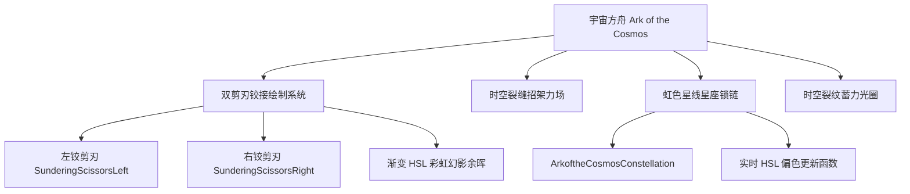

# 银河与整条方舟线特效机制深度分析报告

本报告对灾厄模组（Calamity Mod）中**银河（FourSeasonsGalaxia）**以及其关联的**方舟线（Ark Line）**、**生态巨刃线（Biome Blade Line）**和终极武器**宇宙方舟（Ark of the Cosmos）**的视觉效果、绘制（Draw）逻辑以及粒子（Particle）特效进行了深度剖析与机制整理。

---

## 第一部分：武器谱系与合成关系梳理

在代码实现与游戏设定中，银河与方舟线共同构成了宇宙方舟的两条合成路径。针对用户提到的 **“3+3+17”**，经过代码分析与历史版本对比，这实际上是一个经典的输入法按键误触（在拼音/数字输入下，`+1=7` 极易由于未按下 Shift 或误按导致输出为 `+17`）：

*   **历史/经典谱系（3 + 3 + 1 = 7 把武器）**：
    *   **方舟线 (3)**：折断的方舟 (Fractured Ark) $\rightarrow$ 真·远古方舟 (True Ark of the Ancients) $\rightarrow$ 元素方舟 (Ark of the Elements)
    *   **宇宙线 (3)**：生态巨刃 (Biome Blade) $\rightarrow$ 真·生态巨刃 (True Biome Blade) $\rightarrow$ 银河 (FourSeasonsGalaxia)
    *   **终极合成 (1)**：宇宙方舟 (Ark of the Cosmos)
*   **现代/当前代码库谱系（3 + 4 + 1 = 8 把武器）**：
    当前版本的生态巨刃线（宇宙线）为了使过渡更平滑，增加了两个阶段：
    *   **方舟线 (3)**：[FracturedArk](file:///C:/Users/wangk/Documents/My%20Games/Terraria/tModLoader/ModSources/CalamityMod/Items/Weapons/Melee/FracturedArk.cs) $\rightarrow$ [TrueArkoftheAncients](file:///C:/Users/wangk/Documents/My%20Games/Terraria/tModLoader/ModSources/CalamityMod/Items/Weapons/Melee/TrueArkoftheAncients.cs) $\rightarrow$ [ArkoftheElements](file:///C:/Users/wangk/Documents/My%20Games/Terraria/tModLoader/ModSources/CalamityMod/Items/Weapons/Melee/ArkoftheElements.cs)
    *   **生态巨刃/宇宙线 (4)**：[BrokenBiomeBlade](file:///C:/Users/wangk/Documents/My%20Games/Terraria/tModLoader/ModSources/CalamityMod/Items/Weapons/Melee/BrokenBiomeBlade.cs) $\rightarrow$ [TrueBiomeBlade](file:///C:/Users/wangk/Documents/My%20Games/Terraria/tModLoader/ModSources/CalamityMod/Items/Weapons/Melee/TrueBiomeBlade.cs) $\rightarrow$ [OmegaBiomeBlade](file:///C:/Users/wangk/Documents/My%20Games/Terraria/tModLoader/ModSources/CalamityMod/Items/Weapons/Melee/OmegaBiomeBlade.cs) $\rightarrow$ [FourSeasonsGalaxia](file:///C:/Users/wangk/Documents/My%20Games/Terraria/tModLoader/ModSources/CalamityMod/Items/Weapons/Melee/FourSeasonsGalaxia.cs)
    *   **终极合成 (1)**：[ArkoftheCosmos](file:///C:/Users/wangk/Documents/My%20Games/Terraria/tModLoader/ModSources/CalamityMod/Items/Weapons/Melee/ArkoftheCosmos.cs) （由银河 + 元素方舟 + 5个金源锭在宇宙砧合成）

---

## 第二部分：重中之重 —— “银河”（FourSeasonsGalaxia）特效剖析

银河的特效设计是灾厄 melee 武器的巅峰之一，它拥有**切调星座效果**与**四种星座属性切换的独特弹幕形式**。

### 1. 核心视觉机制：星座切换切调粒子 (Holdout Constellation VFX)
当玩家持有银河并点击右键时，会发射一个无伤害的视觉判定弹幕 [GalaxiaHoldout](file:///C:/Users/wangk/Documents/My%20Games/Terraria/tModLoader/ModSources/CalamityMod/Projectiles/Melee/GalaxiaHoldout.cs)。它会在玩家头顶渲染出对应星座的星图与连线，并伴随闪电音效及 **5.0f 强度的屏幕震动**。

*   **连线与星星粒子**：
    *   **星星 (Stars)**：使用 `GenericSparkle` 粒子渲染。
    *   **星线 (Lines)**：使用 `BloomLineVFX` 粒子进行两两星星之间的连接，开启加法混合模式 (`BlendState.Additive`)。
*   **四大星座星图坐标及色彩**：
    1.  **不死鸟座 (Phoenix - 橙红色 `OrangeRed`)**：绘制 12 颗星，顶点坐标呈现不死鸟展翅的环形闭合轨迹，其中一部分线路在星图外侧独立闭合。
    2.  **白羊座 (Aries - 兰花紫 `Orchid`)**：绘制 5 颗星，呈曲折的斜线星座图。
    3.  **小熊座/北极星 (Polaris - 矢车菊蓝 `CornflowerBlue`)**：绘制 7 颗星。代码中对第一颗星（即北极星）进行了特别处理，使其缩放倍率放大到 `3.0f`，并保持高亮。
    4.  **仙女座 (Andromeda - 皇家紫 `MediumSlateBlue`)**：绘制 16 颗星，星体尺度缩减到 `0.8f`，呈现极其复杂的横向双分支交叉连线结构。

---

### 2. 四种属性（星座守护）弹幕特效细节分析

当玩家左键攻击时，银河根据当前调和状态，分别派生出 4 种完全不同的投影弹幕：

#### A. 不死鸟的骄傲 —— 投掷旋刃与火幕 (`PhoenixsPride`)
*   **弹幕类名**：[PhoenixsPride](file:///C:/Users/wangk/Documents/My%20Games/Terraria/tModLoader/ModSources/CalamityMod/Projectiles/Melee/Galaxia_PhoenixsPride.cs)
*   **连线效果**：当飞刀扔出并滞空时，会使用 `MendedBiomeBlade_HeavensMightChain` 链条纹理在玩家和剑体之间拉起一条**动态抖动锁链**。其透明度由收回进度控制，抖动振幅与拉伸比例在加法混合区域进行计算。
*   **粒子效果**：
    *   飞刀蓄力时，会在刀刃末端生成环状轨迹的 `CircularSmearSmokeyVFX` 雾状刀光，随飞刀旋转而起舞。
    *   飞出时，拖尾产生大量深蓝与紫靛色的 `HeavySmokeParticle`（重烟粒子）和橙黄色的 `CritSpark`（暴击火花粒子）。
    *   **命中 NPC** 时，会在敌人中心召唤出 [PhoenixsPrideFirewall](file:///C:/Users/wangk/Documents/My%20Games/Terraria/tModLoader/ModSources/CalamityMod/Projectiles/Melee/Galaxia_PhoenixsPrideFirewall.cs)，它会根据目标体型缩放（`0.3f` 至 `1.25f`），产生一个持续燃烧的火环屏障。

#### B. 北极星的凝视 —— 碎裂星切与极星突袭 (`PolarisGaze`)
*   **弹幕类名**：[PolarisGaze](file:///C:/Users/wangk/Documents/My%20Games/Terraria/tModLoader/ModSources/CalamityMod/Projectiles/Melee/Galaxia_PolarisGaze.cs)
*   **星环绘制**：刀刃上会附带 3 个不同半径的 `ConstellationRingVFX`（星座环特效），它们会以不同的转速（基准速度 `spinSpeed: 7`）围绕剑身公转，并在边缘产生 3~5 个小星星，随能量充盈度（`ShredRatio`）由暗变亮。
*   **极星顶点**：剑尖生成一颗名为 `PolarStar` 的 `GenericSparkle` 闪烁粒子。当充能度超过 85% 时，它会由纯白色转为闪烁的道奇蓝（`DodgerBlue`），并大幅提高自转速度。
*   **极速冲刺斩**：冲刺击中目标时，在轨迹上释放巨大的 [PolarisGazeDash](file:///C:/Users/wangk/Documents/My%20Games/Terraria/tModLoader/ModSources/CalamityMod/Projectiles/Melee/Galaxia_PolarisGazeDash.cs) 裂屏刀光。

#### C. 仙女座的步伐 —— 超时空蓄力突刺 (`AndromedasStride`)
*   **弹幕类名**：[AndromedasStride](file:///C:/Users/wangk/Documents/My%20Games/Terraria/tModLoader/ModSources/CalamityMod/Projectiles/Melee/Galaxia_AndromedasStride.cs)
*   **蓄力闪烁着色器**：当蓄力到达不同阈值（25%、50%、75%）时，游戏调用 `GameShaders.Misc["CalamityMod:BasicTint"]` 像素着色器，令剑身发出强烈温热的粉红色（`Color(255, 129, 153)`）强光脉冲，并释放包含 5-9 发追踪星弹 [GalaxiaBolt](file:///C:/Users/wangk/Documents/My%20Games/Terraria/tModLoader/ModSources/CalamityMod/Projectiles/Melee/GalaxiaBolt.cs) 的星环散射。
*   **爆裂粒子**：在触发突刺一瞬间，产生粉红色的 `CustomPulse` 脉冲，并使用 `ShatteredExplosion`（碎裂星爆）贴图，向外辐射空间碎裂的华丽特效。
*   **突刺拖尾**：突刺飞行时，在身后留下一条混合了中绿松石色（`MediumTurquoise`）和深橙色（`DarkOrange`）的 `CritSpark` 彗星状火花轨迹。

#### D. 白羊座的愤怒 —— 连环星锁与闪电鞭击 (`AriesWrath`)
*   **弹幕类名**：[AriesWrath](file:///C:/Users/wangk/Documents/My%20Games/Terraria/tModLoader/ModSources/CalamityMod/Projectiles/Melee/Galaxia_AriesWrath.cs)
*   **动态星座锁链**：当剑刃掷出后，会通过 [AriesWrathConstellation](file:///C:/Users/wangk/Documents/My%20Games/Terraria/tModLoader/ModSources/CalamityMod/Projectiles/Melee/Galaxia_AriesWrathConstellation.cs) 在玩家和武器之间实时绘制星座连线。它不是死板的直线，而是每 15 帧动态计算鼠标和玩家的夹角，使用 `BloomLineVFX`（中紫罗兰红 `MediumVioletRed`）和 `GenericSparkle`（梅红色 `Plum`）随机发生分叉与偏折，形成闪电状的星座连线。
*   **命中星爆**：击中敌怪时生成交叉对角线形状的 `LineVFX` 斩击粉尘（持续 6 帧），并在敌怪之间发射连锁的 `GalaxiaBolt`。

---

## 第三部分：方舟线（Ark Line）核心武器特效分析

方舟系列武器最大的特色是 **“双刃铰剪绘制” (Scissor Rendering)** 与 **“招架盾特效” (Parry Shield VFX)**。

### 1. 折断的方舟 (`FracturedArk`) & 真·远古方舟 (`TrueArkoftheAncients`)
*   **刀光挥舞曲线**：使用 `PiecewiseAnimation`（分段动画函数）结合 `EasingType` 缓动公式（Anticipation 蓄势 $\rightarrow$ Thrust 挥切 $\rightarrow$ Hold 保持），使得挥刀具有极强的顿挫感与物理分量感。
*   **溢能粒子**：当武器充能大于 0 时，剑尖每一帧都会漏出带色相偏移（`hueShift: 0.02f`）的蓝白相间 `CritSpark` 溢能火花。
*   **刀光弧面拖尾**：在挥刀后半程，在加法混合区域绘制巨大的半弧形 [TrientCircularSmear](file:///C:/Users/wangk/Documents/My%20Games/Terraria/tModLoader/ModSources/CalamityMod/Particles/TrientCircularSmear.cs) 刀光，并以 HSL 渐变计算弧度颜色，形成彩虹刀光。

### 2. 元素方舟 (`ArkoftheElements`) —— 终极元素剪刃
*   **剪刃双重绘制**：在 `PreDraw` 中，剑身被拆分为 [RendingScissorsLeft](file:///C:/Users/wangk/Documents/My%20Games/Terraria/tModLoader/ModSources/CalamityMod/Projectiles/Melee/RendingScissorsLeft.png) 和 [RendingScissorsRight](file:///C:/Users/wangk/Documents/My%20Games/Terraria/tModLoader/ModSources/CalamityMod/Projectiles/Melee/RendingScissorsRight.png) 两部分。这两部分各自计算旋转中心（即双刃咬合的转轴 gem 位置 `backScissorOrigin`），在挥舞时，两个贴图会以相反的角度剪切闭合。
*   **招架护盾**：右键招架时生成一个呈网格状收缩的元素力场盾，并使用带色彩通道抖动的圆形脉冲粒子。
*   **漫天弹幕**：挥舞时射出由星辰粉碎效果构成的 `ElementalGlassStar` 和追踪针刺 `SolarNeedle`。

---

## 第四部分：终极巅峰 —— 宇宙方舟（Ark of the Cosmos）特效

宇宙方舟集所有特效系统之大成，其视觉演出达到了半像素、半渲染器的顶尖水准。

### 1. 究极双重铰接剪刃绘制 (Scissor Draw)
*   **精确定位转轴**：刀身贴图分为 [SunderingScissorsLeft](file:///C:/Users/wangk/Documents/My%20Games/Terraria/tModLoader/ModSources/CalamityMod/Projectiles/Melee/SunderingScissorsLeft.png) 与 [SunderingScissorsRight](file:///C:/Users/wangk/Documents/My%20Games/Terraria/tModLoader/ModSources/CalamityMod/Projectiles/Melee/SunderingScissorsRight.png)。右侧刀刃旋转中心计算公式为：
    `Owner.Center + drawAngle.ToRotationVector2() * 10f + (drawAngle.ToRotationVector2() * 56f + (drawAngle - MathHelper.PiOver2).ToRotationVector2() * 11 * Owner.direction) * Projectile.scale`
    这使得两把大剪刀在玩家做出不同斩击、投掷与绞合动作时，完美地围绕核心宝石轴心发生差角旋转。
*   **HSL 彩虹幻影余晖**：当开启残影设置且充能时，在 `PreDraw` 中利用 [SunderingScissorsGlow](file:///C:/Users/wangk/Documents/My%20Games/Terraria/tModLoader/ModSources/CalamityMod/Projectiles/Melee/SunderingScissorsGlow.png) 绘制残影。残影的色彩并不是固定单色，而是利用 HSL 颜色模式，根据残影数组索引进行色相循环计算：
    `Color color = Main.hslToRgb((i / (float)Projectile.oldRot.Length) * 0.1f, 1, 0.6f + ...)`
    在斩击时会在空中画出一道绚丽的**渐变彩虹霓虹残影**。

### 2. 时空裂纹招架力场 (Cosmos Parry & Snap)
*   **契合视界光圈**：投掷时，在完美咬合判定窗口（Snap Window）前 6 帧，弹幕会在前端中心释放一个强烈的橙红色 `PulseRing` 脉冲光圈，并发出清脆的提示音。
*   **裂屏闪烁**：成功咬合时，生成大量白色与橙红色的极亮 `GenericSparkle` 星爆，并全屏震屏。
*   **星流裂空弹**：散射出极其华丽的原始星弹 `EonBolt`，这些星弹拖曳着带有宽度渐变与加法混合的彩虹状像素轨迹。

### 3. 虹色星线星座锁链 (`ArkoftheCosmosConstellation`)
*   **机制**：类似于白羊座的星座锁链，但在宇宙方舟上进行了究极升级。
*   **动态彩虹变色**：在 [ArkoftheCosmosConstellation](file:///C:/Users/wangk/Documents/My%20Games/Terraria/tModLoader/ModSources/CalamityMod/Projectiles/Melee/ArkoftheCosmos_Constellation.cs) 中，星连线的颜色在每一帧更新时都会发生 `0.02f` 的色相右移：
    `particle.Color = Main.hslToRgb(Main.rgbToHsl(particle.Color).X + 0.02f, ...)`
    这使得在投掷剪刀时，玩家与剪刀之间连结的星座闪电线会呈现出**动态循环的彩虹流光效果**，流光从玩家体内不断流向飞剪刃，绚丽夺目。

---

## 第五部分：生态巨刃谱系前置调和特效

作为宇宙线的前置武器，生态巨刃系列的切调（Attuning）姿态也拥有非常亮眼的视觉：

*   **雷霆淬火特效**：当玩家在不同地形切换属性时，[TrueBiomeBladeHoldout](file:///C:/Users/wangk/Documents/My%20Games/Terraria/tModLoader/ModSources/CalamityMod/Projectiles/Melee/TrueBiomeBladeHoldout.cs) 会释放出强烈的霓虹色 [ThunderBoltVFX](file:///C:/Users/wangk/Documents/My%20Games/Terraria/tModLoader/ModSources/CalamityMod/Particles/ThunderBoltVFX.cs)（雷电粒子），颜色在金黄（Goldenrod）、绿黄（GreenYellow）、青蓝（Cyan）与洋红（Magenta）之间随机生成。
*   **聚能微尘**：玩家脚底会升起与当前属性颜色相匹配的 `GenericBloom`（光亮微粒）和 `GenericSparkle` 星光，展现了元素充能的律动感。

---

## 结论：特效开发技术特征总结

1.  **极度依赖加法混合 (`BlendState.Additive`) 与立即渲染模式 (`SpriteSortMode.Immediate`)**：大部分环形刀光（如 `TrientCircularSmear`）和星连线均在自定义的 `spriteBatch.Begin` 区块内完成绘制，避免了原版半透明绘制的“脏色”叠加，使霓虹感更纯净。
2.  **分段曲线插值渲染 (`PiecewiseAnimation`)**：抛弃了原版线性挥舞的单调感，所有的方舟和银河挥砍都具有“拉弓蓄力 - 极速爆发 - 略微滞空收招”的动态节奏。
3.  **粒子系统的全自定义接管**：不采用原版的 Dust 系统，而是构建了独立的 `Particle` 类（如 `GenericSparkle`, `BloomLineVFX`, `HeavySmokeParticle`, `CritSpark`）。这些粒子在客户端独立维护生命周期与旋转矩阵，极大降低了性能损耗并支持更复杂的发光与色相偏移。
