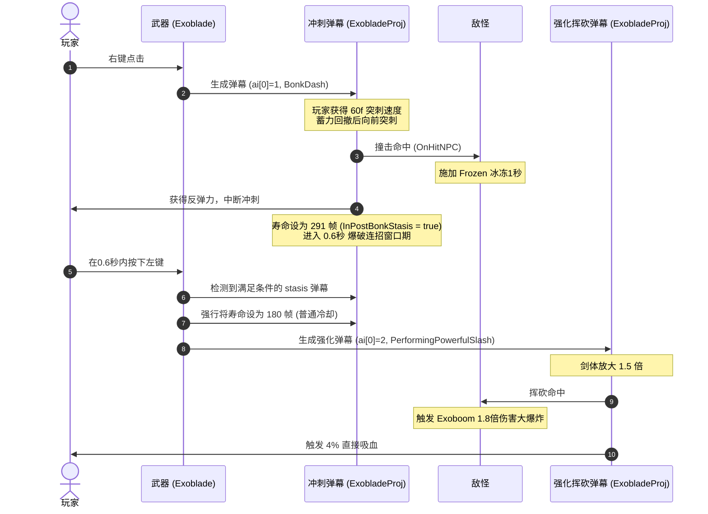

# 星流之刃 (ExoBlade) 武器逻辑分析报告

本报告详细解析了 Calamity Mod 中**星流之刃 (ExoBlade)** 的左键挥砍（Slash）与右键冲刺（Dash/Lunge）的逻辑实现。这两套截然不同的武器行为被统一写在 `Exoblade.cs` 和 `ExobladeProj.cs` 两个文件中，依靠状态机和弹幕（Projectile）来实现精妙的联动。

---

## 一、 核心状态机与参数定义

星流之刃使用弹幕的 `Projectile.ai[0]` 和 `Projectile.ai[1]` 来控制武器的当前状态，具体对应关系如下：

### 1. 状态控制变量
*   **`Projectile.ai[0]` (State / 状态)**
    *   `0`: **普通挥砍 (Swinging - Normal)** —— 左键点击触发的普通横扫。
    *   `1`: **冲刺撞击 (BonkDash)** —— 右键点击触发的冲刺。
    *   `2` 或更大: **强化挥砍 (PerformingPowerfulSlash)** —— 右键冲刺成功撞击敌人后，左键触发的强化大范围挥砍。
*   **`Projectile.ai[1]` (InPostBonkStasis / 撞击后僵直/冷却)**
    *   `0`: 处于正常运动/挥舞状态。
    *   `1`: **僵直/冷却状态 (Post-Bonk Stasis)** —— 冲刺完成或冲刺撞击到敌人后，弹幕不消失，而是留在原处（或跟随玩家），同时不可造成伤害，用于指示冷却时间或作为强化左键的“引信”。

### 2. 关键设计参数 (`Exoblade.cs`)
*   `BaseUseTime = 49`: 基础使用时间（帧）。
*   `DashTime = 49`: 冲刺持续时间。
*   `LungeSpeed = 60f`: 冲刺初速度。
*   `ReboundSpeed = 6f`: 冲刺撞击敌人后的反弹速度。
*   `LungeCooldown = 180`: 冲刺冷却时间（180个更新帧，等于 60 tick，即 1 秒）。
*   `OpportunityForBigSlash = 111`: 冲刺成功后预留给玩家释放“强化挥砍”的窗口期（111个更新帧，约 0.6 秒）。
*   `BigSlashUpscaleFactor = 1.5f`: 强化左键挥砍的剑体体积放大倍率。
*   `BeamsPerSwing = 4`: 左键普通挥砍时发射的追踪星流光束数量。
*   `NotTrueMeleeDamagePenalty = 0.35f`: 追踪光束的伤害削减系数（仅继承 35% 伤害）。
*   `LungeDamageFactor = 1.75f`: 冲刺击中时触发的多重切斩伤害倍率。
*   `ExplosionDamageFactor = 1.8f`: 强化挥砍击中敌人时触发的爆炸伤害倍率。

---

## 二、 左键挥砍 (Swing / Slash) 逻辑实现

左键挥砍包含**普通挥砍**（`ai[0] == 0`）与**强化挥砍**（`ai[0] == 2`）。

### 1. 触发与判定
*   在 `Exoblade.cs` 的 `CanShoot` 中，如果当前没有处于非冷却期的 `ExobladeProj`，则允许左键使用。
*   在 `Shoot` 中，检测当前是否存在处于“撞击后僵直且仍有大招窗口期”的弹幕（即满足 `ai[0] == 1 && ai[1] == 1 && timeLeft > LungeCooldown`）。
    *   若存在，说明玩家在右键撞击敌人后成功接上左键，此时将新生成的弹幕状态设为 `state = 2`（强化挥砍），并将前一个僵直弹幕的剩余寿命强行设为 `LungeCooldown`，使其进入普通冷却，防止二次触发。
    *   若不存在，则为普通挥砍 `state = 0`。

### 2. 运动与表现 (`DoBehavior_Swinging`)
*   **挥舞轨迹与形变**:
    *   通过分段插值函数（PiecewiseAnimation）控制挥舞角度。轨迹由三个阶段构成：慢速启动（SlowStart）、快速横扫（SwingFast）和收尾减速（EndSwing）。最大挥动角为 `1.8 * Pi / 2`（约162度）。
    *   利用 `SquishFactor` 对剑体贴图进行动态挤压拉伸（X方向拉伸，Y方向压扁），配合挥舞动作模拟高速运动中的“视觉形变”。
*   **星流光束发射 (Homing Beams)**:
    *   挥舞进度在 `60%` 至 `100%` 之间时，会在固定间隔分批射出 `BeamsPerSwing` (4个) 追踪光束 `Exobeam`。
    *   光束朝向弹幕朝向的随机小角度偏转，伤害为 `Projectile.damage * 0.35`。
*   **视觉与音效**:
    *   在挥动进度的 20% 时播放 `Exoblade.SwingSound`（普通）或 `Exoblade.BigSwingSound`（强化）。
    *   剑尖发射两种粒子：金色奥金尘（`AuricBarDust`）与七彩虹光尘（`RainbowMk2`）。
    *   绘制阶段（`DrawSlash`）利用灰度流体图（`VoronoiShapes`）和自定义 Shader `"CalamityMod:ExobladeSlash"` 绘制华丽的剑气拖尾。

### 3. 命中效果 (`OnHitNPC`)
*   **普通左键**: 造成普通 Melee 伤害。
*   **强化左键**:
    *   击中敌人时播放 `Exoblade.BigHitSound`。
    *   在目标处生成一个巨大的星流爆炸弹幕 `Exoboom`，伤害倍率为 `1.8f`。
    *   为玩家提供直接生命吸取（吸取伤害的 4%）：`Owner.DoLifestealDirect(target, (int)Math.Round(hit.Damage * 0.04), 0.4f)`。

---

## 三、 右键冲刺 (Dash / Bonk Dash) 逻辑实现

右键冲刺是星流之刃的核心机动与控制手段，其代码代号为 `BonkDash`（“梆”的一声撞上去）。

### 1. 触发与判定
*   `AltFunctionUse` 返回 `true` 允许右键。
*   在 `CanShoot` 中，如果场上**没有任何** `ExobladeProj`（不论是否在冷却），才允许启动右键冲刺。
*   在 `Shoot` 中，如果检测到右键点击，则生成 `state = 1` 的弹幕。

### 2. 运动与表现 (`DoBehavior_BonkDash`)
右键冲刺分为“蓄力回撤”和“急速突刺”两个阶段，时间分配由 `LungeProgression` 控制（后 60% 时间为突刺阶段）。

*   **准备阶段 (蓄力回撤)**:
    *   解挂玩家的所有钩爪，强制玩家下坐骑（`Dismount`）。
    *   在突刺即将开始前播放蓄力音效 `Exoblade.DashSound`。
    *   重置 `oldPos` 用于重绘干净的残影。
    *   利用曲线 `GoBack` 改变剑体偏移（`DashDisplace`），使剑尖先向后缩回蓄力。
*   **突刺阶段**:
    *   计算玩家位置指向鼠标位置的角度。
    *   在突刺过程中，玩家可以有微弱的转向微调能力，调整幅度最大为 `0.05 * Pi/4 * LungeProgression^3`。
    *   突刺速度公式为：`Owner.velocity = 冲刺方向 * LungeSpeed * (0.24 + 0.76 * velocityPower)`，其中 `velocityPower` 随正弦曲线波动。最大速度可达 60f。
    *   开启 `Owner.Calamity().LungingDown = true` 判定。
    *   剑体在此阶段会迅速缩小（基于 `LungeProgression^7` 从 1.0 缩减至 0.22），表现出强烈的穿透感。
*   **拖尾效果 (`DrawPierceTrail`)**:
    *   读取 `Projectile.oldPos` 数组中的前 60 个位置，稀释渲染出 30 个顶点的透视光带。
    *   使用自定义 Shader `"CalamityMod:ExobladePierce"` 以及拖尾图 `EternityStreak`，颜色呈红黄绿蓝动态渐变，呈现极光般的穿透轨迹。

### 3. 命中与反弹 (The "Bonk" Logic)
*   **伤害判定判定区**:
    *   冲刺状态下的碰撞体积比普通挥砍更宽（`scale * 45` vs `scale * 30`），且在冲刺开始的前 40% 时间（回撤蓄力期）是不具有伤害判定（`CanDamage` 返回 `false`）的。
*   **击中目标后的处理 (`OnHitNPC`)**:
    *   **强行打断冲刺**: 玩家的物品使用动画归零（`Owner.itemAnimation = 0`）。
    *   **后撤步 (Rebound)**: 玩家获得远离目标方向的反向速度 `ReboundSpeed = 6f`。
    *   **目标控制**: 强行给被击中的目标施加 **1秒的冰冻 Buff** (`target.AddBuff(BuffID.Frozen, 60)`)，使其定在原地，方便玩家瞄准接左键。
    *   **多重切斩**: 在目标位置瞬间生成 5 个 `ExobeamSlashCreator` 弹幕，造成 `1.75` 倍伤害的多重斜切斩击视觉效果，并播放激烈的撞击音 `Exoblade.DashHitSound`。
    *   **进入强化窗口期 (Stasis)**: 弹幕寿命 `timeLeft` 被重置为 `OpportunityForBigSlash + LungeCooldown` (111 + 180 = 291帧)。同时将 `InPostBonkStasis` 设为 `true`。在此状态下，剑体贴图隐形且不再造成碰撞伤害，仅仅在后台作为一个“计数器”等待左键的连招。

### 4. 未击中敌人时的自然冷却
*   如果冲刺过程中没有碰撞到任何敌人，当弹幕时间走到最后一帧（`timeLeft == 1`）时：
    *   玩家速度减弱为原来的 20% (`velocity *= 0.2f`)。
    *   弹幕寿命被强行重设为 `LungeCooldown` (180帧)，且将 `InPostBonkStasis` 设为 `true`，此时玩家进入 1 秒的冷却时间，期间无法再次使用武器。

---

## 四、 左键与右键的联动逻辑流程 (连招)

星流之刃的完美连招流程（右键冲刺撞击 -> 左键强化爆破）可以用以下时序图概括：



### 关键代码片段对照

#### 1. 左键如何检测并消耗右键的“撞击标记” (`Exoblade.cs`)
```csharp
// Shoot 方法中检测
bool empoweredSlash = false;
foreach (Projectile p in Main.ActiveProjectiles)
{
    // 寻找处于 post-bonk 僵直 (ai[0]==1, ai[1]==1) 且仍在 0.6 秒窗口期内 (timeLeft > LungeCooldown) 的弹幕
    if (p.owner == player.whoAmI && p.type == Item.shoot && p.ai[0] == 1 && p.ai[1] == 1 && p.timeLeft > LungeCooldown)
    {
        empoweredSlash = true;
        break;
    }
}

if (empoweredSlash)
{
    state = 2; // 设为强化挥砍

    // 消耗该标记：将所有前置弹幕的 timeLeft 设为普通的 LungeCooldown，使其退出连招窗口期
    foreach (Projectile p in Main.ActiveProjectiles)
    {
        if (p.owner != player.whoAmI || p.type != Item.shoot || p.ai[0] != 1 || p.ai[1] != 1)
            continue;

        p.timeLeft = LungeCooldown;
        p.ForceNetUpdate();
    }
}
```

#### 2. 右键命中后如何设置僵直与窗口期 (`ExobladeProj.cs` - `OnHitNPC`)
```csharp
if (State == SwingState.BonkDash)
{
    Owner.itemAnimation = 0; // 终止挥舞动画
    Owner.velocity = Owner.SafeDirectionTo(target.Center) * -Exoblade.ReboundSpeed; // 反弹
    
    // 重置剩余时间：大招窗口期 (111) + 基础冷却时间 (180) = 291 帧
    Projectile.timeLeft = Exoblade.OpportunityForBigSlash + Exoblade.LungeCooldown;
    InPostBonkStasis = true; // 进入僵直标记

    Projectile.netUpdate = true;
    
    // 播放音效与多重切斩视觉特效
    SoundEngine.PlaySound(Exoblade.DashHitSound, target.Center);
    // ... 发射 ExobeamSlashCreator ...
    
    // 冻结目标 1 秒
    target.AddBuff(BuffID.Frozen, 60);
}
```

---

## 五、 对新武器开发的启示与建议

在 `CalamityLegendsComeBack` 模组开发新武器时，这种“双键合一文件”的设计提供了极佳的参考价值：
1. **单弹幕多状态机**: 避免为左键和右键注册两个独立的 `ModProjectile` 类。所有的绘制逻辑（Shader、拖尾渲染）以及碰撞逻辑都在同一个 Projectile 类中通过 `switch(State)` 切换，极大减少了资源加载与代码冗余。
2. **状态共享与弹幕检索**: 通过遍历 `Main.ActiveProjectiles`（或 `Main.projectile`）寻找属于玩家自己的特定状态弹幕，是实现**武器蓄力连招、二段攻击、派生攻击**非常稳定可靠的手段。
3. **气势与受击反馈**: 右键冲刺附加短时间硬控（Frozen）并给玩家提供反向后退（Rebound），配合 `ExobeamSlashCreator` 切斩特效，具有极强的连招引导性和极高的手感舒适度。
4. **多更新帧技术 (`MaxUpdates`)**: 该弹幕使用了 `MaxUpdates = 3`，使得粒子表现极度丝滑，但这也意味着所有的计时器相关逻辑（如 `timeLeft`）必须乘上倍率，在设计自定义冷却时需格外注意物理帧与更新帧的换算。
