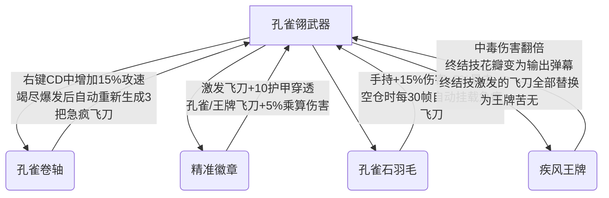

# 孔雀翎 (Malachite) 完全解析指南

孔雀翎（Malachite）是一把机制设计极其精致、极具操作深度的盗贼职业武器。本指南对其职业定位、核心战斗机制、攒满/不满判定、六大攻击方式以及专属饰品的协同搭配进行完整剖析。

---

## 一、 武器基本信息与职业定位

*   **职业分类**：**盗贼（Rogue）**
*   **伤害类型**：盗贼伤害（Rogue Damage），受盗贼相关属性（如潜伏值、攻速、盗贼暴击等）的加成。
*   **稀有度**：黄绿色（Burnished Auric，本模组自定义稀有度）
*   **基础面板**：
    *   基础伤害：180
    *   使用时间/使用动画：14 帧（潜伏攻击为 34 帧，右键为 24 帧）
    *   击退：2.5
    *   基础弹幕速度：18

---

## 二、 核心战斗机制

孔雀翎的战斗体系围绕“浮空外挂”、“资源爆发”和“身法操作”展开：

### 1. “外挂苦无”（Stored Kunais / 挂载苦无）机制
使用特定技能时，玩家身后会浮空挂载不同类型的飞刀。它们会悬浮在玩家背后（呈扇形或刀扇状），可以通过左键普攻逐把掷出，或通过特定招式一次性全部激发。
*   **急疯苦无（Frenzy Kunai）**：右键生成，最多在身后挂载 3 把，构成一个小刀扇。
*   **孔雀苦无（Peacock Kunai）**：潜伏攻击生成，最多在身后挂载 23 把，呈华丽的孔雀开屏状。

### 2. “空仓爆发 / 竭尽爆发”（Depletion Burst）机制
*   当玩家将身后悬浮的**所有外挂苦无全部投掷完毕**、挂载数量归零的一瞬间，会立即触发持续 **90 帧（1.5 秒）** 的“竭尽爆发”状态。
*   在此状态下，左键普攻的苦无数量直接暴增至 **5 把**（呈现中等扇形散射），但每把飞刀的伤害系数调整为 78%。这是打空外挂飞刀后的强力平A倾泻手段。

### 3. “擦弹”（Graze Detection）机制
*   手持孔雀翎时，玩家获得擦弹能力。当敌方弹幕接近玩家（检测箱判定外扩 42 像素）但并未实际击中玩家时，会判定为“擦弹”。
*   每次成功擦弹会伴随清脆的声音与绿色的粒子特效，并为玩家**恢复最大潜伏值的 1%**。

### 4. 潜伏被动属性加成
*   **灵动步伐/暗影步 (Shadow Step)**：手持武器且当前潜伏值高于最大值的 **50%** 时，玩家获得 **+15% 伤害减免**、**+15% 移动速度**、**+35% 最大奔跑速度** 和 **1.08 倍奔跑加速度**。
*   **幻影之刃 (Phantom Blade)**：使用潜伏攻击后，立即返还 **15 点潜伏值**。

---

## 三、 外挂苦无“攒满”与“不满”的判定

### 1. 右键的【急疯苦无】攒满 vs 不满
*   **未攒满（身后急疯苦无 < 3把）**：按下右键时，会清除已有的急疯苦无，并在身后重新生成并挂载 3 把构成刀扇。
*   **已攒满（背后刚好有 3 把）**：再次按下右键将**激发（Activate）**这 3 把苦无。它们会朝鼠标方向飞出，伤害增幅至 **1.85 倍**，拥有**无限穿透**与**无视物块（穿墙）**能力，且命中无敌帧冷却减少到 4 帧（对群与大型怪物输出极高）。激发后会自动重新挂载 3 把。右键操作有 3 秒冷却。

### 2. 潜伏攻击的【孔雀苦无】攒满 vs 不满
*   **未攒满（背后挂有 1 - 22 把孔雀苦无）**：使用潜伏攻击（无论左键还是右键）时，会先将当前背后的孔雀苦无一齐朝鼠标方向射出，然后重新在背后挂满 23 把。
*   **已攒满或没有（背后有 0 或 23 把）**：使用潜伏攻击时，会直接在背后挂载满 23 把孔雀苦无。
*   *注：孔雀苦无在射出时会自动快速追踪敌怪（每帧最多转角 3 度），无法穿透。其中的“王牌苦无”基础伤害更高（2.05倍，普通为 1.28倍），命中时会引发“孔雀翎爆破”造成 65% 的溅射伤害。*

---

## 四、 整把武器的 6 种攻击方式

| 序号 | 攻击方式 | 触发条件 | 弹幕特点与效果 |
| :--- | :--- | :--- | :--- |
| 1 | **普通左键投掷** | 背后无挂载苦无时点击左键 | 苦无在身侧蓄势 10 帧后飞出。肉前 1 把；肉后无重力影响；击败瘟鹰后 2 把；击败月总后 3 把。 |
| 2 | **倾泻外挂飞刀** | 背后有挂载苦无时点击左键 | 按照插槽顺序逐个投掷背后的苦无（每点一次扔一把），直至打空。 |
| 3 | **空仓爆发普攻** | 外挂苦无打空后的 1.5 秒内 | 左键投掷数暴增至 **5 把**（散射，伤害系数 78%）。 |
| 4 | **右键刀扇/激发** | 点击右键 | 挂载 3 把急疯苦无；满 3 把时激发高速穿墙飞刀。有 3 秒冷却时间。 |
| 5 | **潜伏·孔雀开屏** | 满潜伏时攻击 (左/右键) | 射出旧刀并重新挂载 23 把高伤害追踪孔雀苦无（包含 1 把带爆破的王牌苦无）。 |
| 6 | **终结技·孔雀翎终结式** | 手持、满潜伏、60秒CD结束时按 [LegendarySkill] 键 | 玩家获得短暂无敌并蓄力 2 秒（伴随花瓣与聚光视效）；蓄力结束后横扫挥出前方的巨型斩击，并在周围敌人身上引发多段带黑洞核心的大型绿色爆炸。 |

---

## 五、 专属饰品组合与战斗套路

本模组专门为孔雀翎设计了 4 件专属盗贼饰品，穿戴后可解锁更为强大的流派组合：

### 1. 核心战斗连招套路
*   **潜伏开屏 -> 单体倾泻 -> 竭尽散弹**：
    先用潜伏攻击在身后挂满 23 把追踪孔雀苦无，然后利用普通左键快速一发发将这 23 把高伤害、追踪苦无射向目标。当飞刀打空的瞬间，立刻触发“竭尽爆发”，在随后的 1.5 秒内疯狂左键平A，利用每次 5 发的散弹雨倾泻火力。
*   **右键激发 -> 竭尽爆发**：
    双击右键（生成并激发 3 把穿墙穿透苦无），清空外挂栏，瞬间切入竭尽爆发进行 1.5 秒的左键 5 连散射，适合清理成群的小怪或近身对大型Boss进行爆破。

### 2. 饰品套路详解
1.  **自动挂载流（孔雀石羽毛 + 右键激发）**：
    *   装备 **【孔雀石羽毛】** 时，当背后没有任何飞刀，每 0.5 秒会自动生成一把急疯苦无挂在身后。
    *   在实战中，玩家甚至不需要手动按右键去挂载苦无，只需正常跑图或躲避，等 1.5 秒自动挂满 3 把后，直接右键便可直接释放 1.85 倍伤害的无限穿透飞刀。
2.  **无限刀扇流（孔雀卷轴 + 竭尽爆发）**：
    *   击败世纪之花后，装备 **【孔雀卷轴】**，在玩家打空飞刀触发竭尽爆发（左键加速）后，卷轴会自动直接在身后**免费重新生成 3 把急疯苦无**。这省去了手动右键挂载的时间，允许玩家迅速再次按下右键进行“满载激发”，战斗循环极为平滑。
3.  **王牌核爆流（疾风王牌 + 终结技）**：
    *   装备 **【疾风王牌】** 时，中毒伤害翻倍，且终结技蓄力期间飘落的花瓣也会产生攻击判定。
    *   最强效果：**通过终结技激发外挂苦无时，会将身后的所有苦无全部替换为王牌苦无（Ace）**。如果玩家在背后挂有 23 把孔雀苦无，释放终结技时它们会全部转换为王牌苦无射出，命中敌人时会瞬间引发 23 次“孔雀翎爆破”的迷你绿光爆炸，造成毁灭性的瞬间核爆级伤害。
